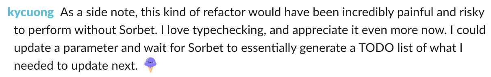
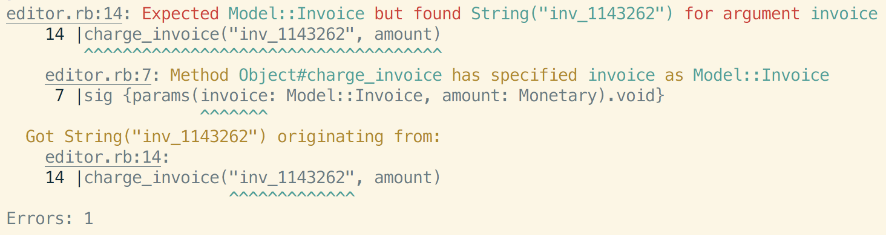

# Sorbet at Stripe

## Why and how we built a type&nbsp;checker for Ruby


<br>

Note:

- Been at Stripe for 2 years
- Working on Sorbet for the past year

---

- **About Stripe**

- Why build a type checker for Ruby

- How we designed Sorbet

---

## What is Stripe? 🤔

&nbsp;

> Stripe is a software platform for running a business
> online.

Note:

Startups you've never heard of as well as huge companies
like Facebook and Lyft use our APIs to accept payments from
anywhere and run their business online.

We really try to remove the barriers that make it hard to
start and operate a business. Our long term goal is to
increase the size of the internet economy because our
software has made it so much easier to run a business
online.

**Favorite part**: our users are developers

---

## 🔎 About Stripe

- More than **2,000 employees**

- More than 250 million API requests per day<br>
  (peak of **13,000 requests a second**)

- Engineers in San Francisco, Seattle, Dublin, Singapore,
  and more...

- **We're hiring!** (interns and full time)

Note:

Come chat with us after!

---

- About Stripe

- **Why build a type checker for Ruby**

- How we designed Sorbet

---

## Context: Developer Productivity ✨

- "Break down obstacles to getting things done"

- Avoid thinking about incidental complexity

Note:

- Local dev flow
- CI
- Universal abstractions / libraries
- Work with not against the tools
- Impact multiplier

---

## Context: Ruby at Stripe 💎

- Ruby is our primary programming language

- Hundreds of engineers

- Millions of lines of code

- Thousands of changes to the monorepo per day

Note:

Compare Ruby to Python

---

## 💡 ... breaking down obstacles?

- Too long to run the tests

- Too hard to understand certain code

- Too easy to break the code

Note:

"Millions of lines of code, no idea what to do with it all."

Want to fix these **without** running the code.

---

## 💡 The language is an obstacle

- Too long to run the tests

- Too hard to understand certain code

- Too easy to break the code


---

## ➡️  What are our options?

- **Do nothing**: Opportunity cost (productivity, breakages)

- **Rewrite everything**: 100s of engineers, all-or-nothing

- **Rewrite some things**: 10s(?) of engineers, partial impact

- **Type checker**: 3 engineers, incremental value in months

---

## Sorbet’s history from 10,000 ft

- **8 months** initial conception (Oct 2017 – May 2018)

- **7 months** internal rollout (Jun 2018 – Dec 2018)

- **9+ months** public release and IDE tooling (Jan 2019 – ···)

---

## Sorbet’s history from 10,000 ft

- **8 months** initial conception (Oct 2017 – May 2018)

- <span style="opacity: 0.3;">**7 months** internal rollout (Jun 2018 – Dec 2018)</span>

- <span style="opacity: 0.3;">**9+ months** public release and IDE tooling (Jan 2019 – ···)</span>

Note:

Started knowing nothing more than that we wanted to type
check Ruby.

Implemented a feature, made sure it worked, and moved onto
the next one.

---

## Sorbet’s history from 10,000 ft

- <span style="opacity: 0.3;">**8 months** initial conception (Oct 2017 – May 2018)</span>

- **7 months** internal rollout (Jun 2018 – Dec 2018)

- <span style="opacity: 0.3;">**9+ months** public release and IDE tooling (Jan 2019 – ···)</span>

---

### Uninitialized constant errors

```ruby

class Hello

end

def main
  puts Helo.new
end

main
```

<pre><code>


</code></pre>

Note:

Focused on identifying then preventing errors.

---

### Uninitialized constant errors

```ruby

class Hello

end

def main
  puts Helo.new
end

main
```

```console
❯ ruby hello.rb
hello.rb:7:in `main': uninitialized constant Helo (NameError)
Did you mean?  Hello
        from hello.rb:12:in `<main>'
```

Note:

- Maybe we'll hear about it in 5 to 15 minutes when the tests run
- Maybe we'll hear about it later today when we deploy the change
- Maybe we'll hear about it 4 in the morning from a group of
  very upset users whose business we've just completely
  broken

---

### Uninitialized constant errors

```ruby

class Hello

end

def main
  puts Helo.new
end

main
```

```console
❯ srb
hello.rb:7: Unable to resolve constant `Helo`
     7 |  puts Helo.new
               ^^^^
```

Note:

- So with Sorbet we just run Sorbet on our project and it
  points directly to the line where we messed up.

---

### 🎉 100% of Ruby files at Stripe!

```ruby

class Hello

end

def main
  puts Helo.new
end

main
```

```console
❯ srb
hello.rb:7: Unable to resolve constant `Helo`
     7 |  puts Helo.new
               ^^^^
```

---

### Undefined method errors

```ruby

class Hello
  def greeting; 'Hello, world!'; end
end

def main
  puts Hello.new.greet
end

main
```

<pre><code>


</code></pre>

---

### Undefined method errors

```ruby

class Hello
  def greeting; 'Hello, world!'; end
end

def main
  puts Hello.new.greet
end

main
```

```console
❯ ruby hello.rb
hello.rb:7:in `main': undefined method `greet'
Did you mean?  greeting
        from hello.rb:10:in `<main>'
```

Note:

We'd like to be able to use Sorbet to augment our
confidence; to gain more than just tests alone would give
us.

---

### Undefined method errors

```ruby
# typed: true
class Hello
  def greeting; 'Hello, world!'; end
end

def main
  puts Hello.new.greet
end

main
```

```console
❯ ruby hello.rb
hello.rb:7:in `main': undefined method `greet'
Did you mean?  greeting
        from hello.rb:10:in `<main>'
```

---

### Undefined method errors

```ruby
# typed: true
class Hello
  def greeting; 'Hello, world!'; end
end

def main
  puts Hello.new.greet
end

main
```

```console
❯ srb
hello.rb:7: Method greet does not exist on `Hello`
     7 |  puts Hello.new.greet
               ^^^^^^^^^^^^^^^
```

---

### 🎉 80% of Ruby files at Stripe!

```ruby
# typed: true
class Hello
  def greeting; 'Hello, world!'; end
end

def main
  puts Hello.new.greet
end

main
```

```console
❯ srb
hello.rb:7: Method greet does not exist on `Hello`
     7 |  puts Hello.new.greet
               ^^^^^^^^^^^^^^^
```

Note:

Why only 80%?

Getting files into `typed: true` means fixing a lot of errors!
We built tools to automate the process, but it's still work.

---

## More than just errors

- What types does this method take?
- Could this thing be nil?

Note:

`nil` is basically like `None` in Python.

---

### &nbsp;

```ruby

def do_thing(x)
  # ...
end

do_thing('some string')  # is this ok?
do_thing(nil)            # is this ok?
```

---

### &nbsp;

```ruby
sig {params(x: String).void}
def do_thing(x)
  # ...
end

do_thing('some string')  # is this ok?
do_thing(nil)            # is this ok?
```

---

### &nbsp;

```ruby
sig {params(x: String).void}
def do_thing(x)
  # ...
end

do_thing('some string')  # 😎 this is ok!
do_thing(nil)            # ❌ this is not ok!
```

---

### 🎉 62% of methods at Stripe have a signature!

```ruby
sig {params(x: String).void}
def do_thing(x)
  # ...
end

do_thing('some string')  # 😎 this is ok!
do_thing(nil)            # ❌ this is not ok!
```

---

## And it's fast 💨

&nbsp;

&nbsp;

Note:

At first, we would have been ok with taking 20 minutes.
Now, we're getting asked for *sub-second* response times.

**Ask** and we can talk more about perf.

---

## And it's fast 💨

Millions of lines of code...

... type checks in seconds.

Note:

At first, we would have been ok with taking 20 minutes.
Now, we're getting asked for *sub-second* response times.

**Ask** and we can talk more about perf.

---

### ⏪ Recap: What we achieved

- **100%** of files: catch uninitialized constants!
- **80%** of files: catch NoMethodError's!
- **62%** of methods have signatures!
- Type checks millions of lines in seconds

---

## Sorbet’s history from 10,000 ft

- <span style="opacity: 0.3;">**8 months** initial conception (Oct 2017 – May 2018)</span>

- **7 months** internal rollout (Jun 2018 – Dec 2018)

- <span style="opacity: 0.3;">**9+ months** public release and IDE tooling (Jan 2019 – ···)</span>

---

## Sorbet’s history from 10,000 ft

- <span style="opacity: 0.3;">**8 months** initial conception (Oct 2017 – May 2018)</span>

- <span style="opacity: 0.3;">**7 months** internal rollout (Jun 2018 – Dec 2018)</span>

- **9+ months** public release and IDE tooling (Jan 2019 – ···)

---

# open source! 🎉

<br>

[sorbet.org](https://sorbet.org) – website & docs

[github.com/sorbet/sorbet](https://github.com/sorbet/sorbet) – source code

Note:

Lots of contributors

---

## Editor tooling: Errors & Hover


---

## Editor tooling: Go To Definition


---

## Editor tooling: Completion + Docs


---

## Try it yourself!

<br>

[sorbet.run](https://sorbet.run)

<br>

*(IDE features only work on desktop)*

---

## 🎤 What our users say

---


---

## 💪 Refactor with confidence



---

## 🔎 Tool for understanding


---

## Sorbet’s history from 10,000 ft

- <span style="opacity: 0.3;">**8 months** initial conception (Oct 2017 – May 2018)</span>

- <span style="opacity: 0.3;">**7 months** internal rollout (Jun 2018 – Dec 2018)</span>

- **9+ months** public release and IDE tooling (Jan 2019 – ···)

Note:

That's where we are.

We've seen overwhelming success from this incremental
migration.

---

- About Stripe

- Why build a type checker for Ruby

- **How we designed Sorbet**

---

## 🙌 Sorbet's Design Principles

<span>1. Explicit</span>

<span>2. Useful, not burdensome</span>

<span>3. As simple as possible, but powerful enough</span>

<span>4. Compatible with Ruby</span>

<span>5. Scalable on all axes</span>

<span>6. Gradual</span>

---

## 1. Explicit

```ruby


def charge_invoice(invoice, amount)
  # ...
end
```

&nbsp;

&nbsp;

&nbsp;

---

## 1. Explicit

```ruby
# typed: true

def charge_invoice(invoice, amount)
  # ...
end
```

&nbsp;

&nbsp;

&nbsp;

---

## 1. Explicit

```ruby
# typed: true
sig {params(invoice: Invoice, amount: Monetary).void}
def charge_invoice(invoice, amount)
  # ...
end
```

&nbsp;

&nbsp;

&nbsp;

---

## 1. Explicit

```ruby
# typed: true
sig {params(invoice: Invoice, amount: Monetary).void}
def charge_invoice(invoice, amount)
  # ...
end
```

Takes an invoice object (not a string invoice ID)

Monetary accounts for currency (not just an integer)

Void return: run for side-effects only

---

## 2. Useful, not burdensome

<!-- {{{ -->

```console
requests/completion.cc:70:80: error: reference member of type 'const shared_ptr<core::TypeConstraint> &' uninitialized
                result.emplace_back(SimilarMethod{depth, receiver, memberSymbol});
                                                 ~~~~~~~~~~~~~~~~~~~~~~~~~~~~~~^
requests/completion.cc:52:45: note: uninitialized reference member is here
    const shared_ptr<core::TypeConstraint> &constr;
                                            ^
requests/completion.cc:116:30: error: no viable overloaded '='
        similarMethod.constr = constr;
        ~~~~~~~~~~~~~~~~~~~~ ^ ~~~~~~
memory:3840:17: note: candidate function not viable: 'this' argument has type 'const shared_ptr<core::TypeConstraint>', but method is not marked const
    shared_ptr& operator=(const shared_ptr& __r) _NOEXCEPT;
                ^
memory:3848:9: note: candidate function template not viable: 'this' argument has type 'const shared_ptr<core::TypeConstraint>', but method is not marked const
        operator=(const shared_ptr<_Yp>& __r) _NOEXCEPT;
        ^
memory:3859:9: note: candidate function template not viable: 'this' argument has type 'const shared_ptr<core::TypeConstraint>', but method is not marked const
        operator=(shared_ptr<_Yp>&& __r);
        ^
memory:3851:17: note: candidate function not viable: 'this' argument has type 'const shared_ptr<core::TypeConstraint>', but method is not marked const
    shared_ptr& operator=(shared_ptr&& __r) _NOEXCEPT;
                ^
memory:3893:9: note: candidate template ignored: could not match 'unique_ptr' against 'shared_ptr'
        operator=(unique_ptr<_Yp, _Dp>&& __r);
        ^
In file included from requests/completion.cc:1:
In file included from external/com_google_absl/absl/strings/str_cat.h:56:
In file included from array:112:
algorithm:1811:21: error: object of type 'sorbet::realmain::lsp::(anonymous namespace)::SimilarMethod' cannot be assigned because its copy assignment operator is implicitly deleted
        *--__result = _VSTD::move(*--__last);
                    ^
algorithm:1840:19: note: in instantiation of function template specialization 'std::__1::__move_backward<sorbet::realmain::lsp::(anonymous namespace)::SimilarMethod *, sorbet::realmain::lsp::(anonymous namespace)::SimilarMethod *>' requested here
    return _VSTD::__move_backward(__unwrap_iter(__first), __unwrap_iter(__last), __unwrap_iter(__result));
                  ^
vector:1764:12: note: in instantiation of function template specialization 'std::__1::move_backward<sorbet::realmain::lsp::(anonymous namespace)::SimilarMethod *, sorbet::realmain::lsp::(anonymous namespace)::SimilarMethod *>' requested here
    _VSTD::move_backward(__from_s, __from_s + __n, __old_last);
           ^
vector:2026:17: note: in instantiation of member function 'std::__1::vector<sorbet::realmain::lsp::(anonymous namespace)::SimilarMethod, std::__1::allocator<sorbet::realmain::lsp::(anonymous namespace)::SimilarMethod> >::__move_range' requested here
                __move_range(__p, __old_last, __p + __old_n);
                ^
requests/completion.cc:80:10: note: in instantiation of function template specialization 'std::__1::vector<sorbet::realmain::lsp::(anonymous namespace)::SimilarMethod, std::__1::allocator<sorbet::realmain::lsp::(anonymous namespace)::SimilarMethod> >::insert<std::__1::__wrap_iter<sorbet::realmain::lsp::(anonymous namespace)::SimilarMethod *> >' requested here
    left.insert(left.end(), right.begin(), right.end());
         ^
requests/completion.cc:52:45: note: copy assignment operator of 'SimilarMethod' is implicitly deleted because field 'constr' is of reference type 'const shared_ptr<core::TypeConstraint> &'
    const shared_ptr<core::TypeConstraint> &constr;
                                            ^
In file included from requests/completion.cc:1:
In file included from external/com_google_absl/absl/strings/str_cat.h:56:
In file included from array:112:
algorithm:1636:19: error: object of type 'sorbet::realmain::lsp::(anonymous namespace)::SimilarMethod' cannot be assigned because its copy assignment operator is implicitly deleted
        *__result = *__first;
...
...
... 400 more lines of errors
...
...

fatal error: too many errors emitted.

.
```

<!-- }}} -->

Note:

This error was because I put `&` in a place where I
shouldn't have.

For effect: Scroll to bottom, laugh at "too many errors"

---

## 2. Useful, not burdensome



&nbsp;

&nbsp;

---

## 2. Useful, not burdensome

```ruby
sig {params(xs: T::Array[Integer]).returns(String)}
def foo(xs)
  ys = xs.map {|x| x.to_s}  # T::Array[String]
  msg = ys.join('\n')       # String
  msg
end
```

---

## 3. As simple as possible, but powerful enough

- Union & intersection types

- Control-flow dependent typing

- Exhaustiveness checking

- Generic classes and methods

- Abstract classes and interfaces

---

## 4. Compatible with Ruby

- Our type syntax is valid Ruby code!

- Existing tools work: IDEs, linters, no transpiler, ...

- Syntax highlighting and autocompletion for free!

Note:

Wouldn't get this with comment-based syntax

---

## 5. Scalable on all axes

- **Team size** (single person to thousands)

- Number of **independent teams** (faster / slower paces)

- Passage of **time** (easy to roll back a decision)

- Size of **code base** (Sorbet must be fast!)

---

## 6. Gradual

- Adoptable incrementally!

- Don't have to rewrite everything!

- Can reuse all existing tooling!

- **The catch**: types can be turned OFF at any time 😰

Note:

A bit of a double edged sword

---

## **`T.untyped`**: Turning off types 🙈

- Every value can be asserted to have type **`T.untyped`**

- Every value of type **`T.untyped`** can be asserted to be any other type!

---

## **`T.untyped`**: An example 🍎

```ruby
# T.let asserts that an expression has a type:
x = T.let(0, Integer)

# Anything can be T.untyped:
y = T.let(x, T.untyped)

# and T.untyped can be anything!
z = T.let(y, String)

T.reveal_type(x) # => Integer
T.reveal_type(y) # => T.untyped
T.reveal_type(z) # => String

# ... z = 0, but its type is String!
```

---

# 🙅‍♂️ No thank you!

&nbsp;

&nbsp;

---

# 🙅‍♂️ No thank you?

&nbsp;

&nbsp;

---

# 🙅‍♂️ Well actually...

This is what enabled our initial rollout!

We can **manage the downsides**.

---

## Static AND runtime checks 👫

```ruby
# (1) Must accept an Integer
sig {params(x: Integer).void}
def foo(x); ...; end

# (2) Pretend: "some untyped code"
x = T.let('not an int', T.untyped)

# (3) No static type errors...
foo(x)   # => ... raises exception when run!
```

---

## Runtime type checks in practice

- CI test runs become tests of the types

- Production monitoring becomes type-monitoring

- Successful deploys grant incremental confidence

- Know **immediately** when untyped code violates the types

Note:

Sorbet team monitors perf overhead of runtime type checking;
we page if it goes over single-digit percents.

---

## 🔄 The lifecycle of **`T.untyped`**

1. **Initial ramp up** (only the "early adopters" in a project)

1. The **transitional period** (core abstractions gain types)

1. The **long tail** ("feels" more typed than untyped)

Note:

- Useful for short term, incremental adoption

- Harms our long term confidence in the code

---

## Designed for migration 🚂

**Not** designed to be the best choice for a new codebase!

Delivers **outsized value** in existing codebases<br>
(especially large ones)

Note:

- Arguably better to pick a language with 100% type coverage
  from day one

---

## What's next? 🚀

- Invest heavily in editor tools

- Make it even faster

- Implement most-needed language features

---

# Questions❓

---

## Thanks for coming!

- We're hiring ([stripe.com/jobs](https://stripe.com/jobs))

- Feel free to come up and chat


<!-- vim:tw=60
-->
