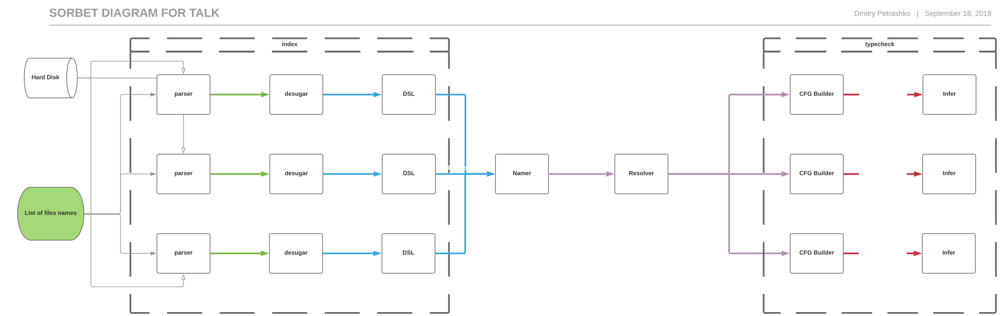
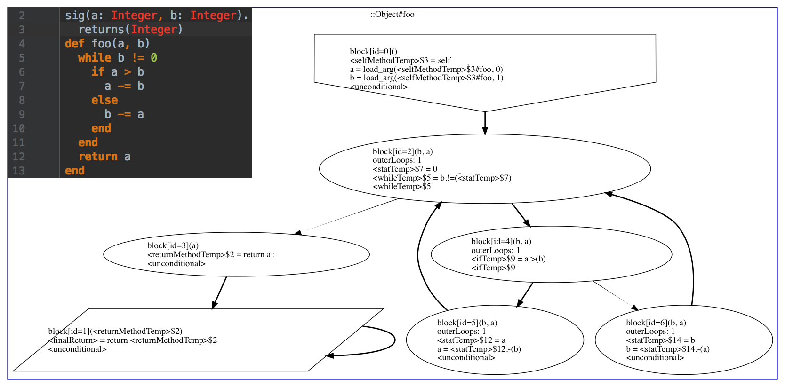
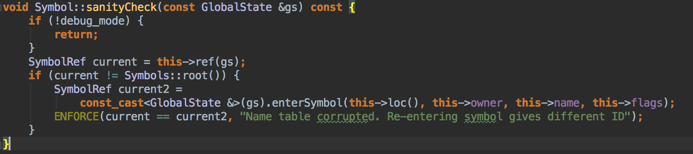
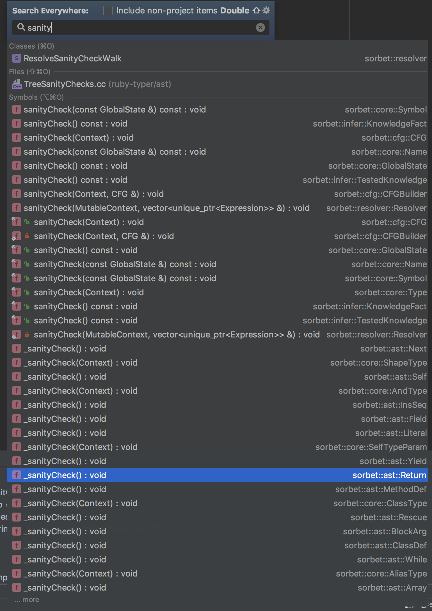
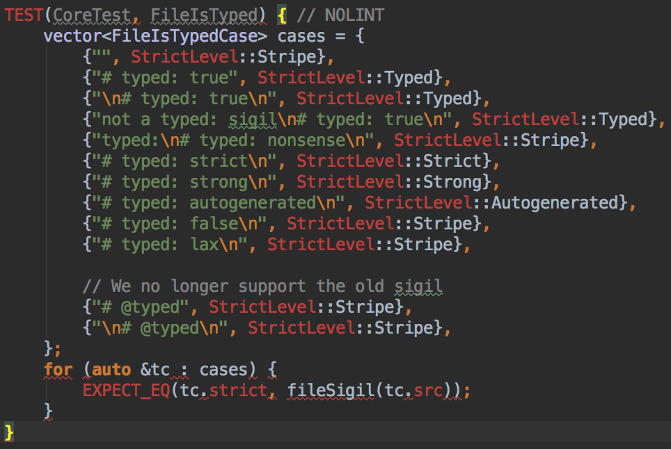
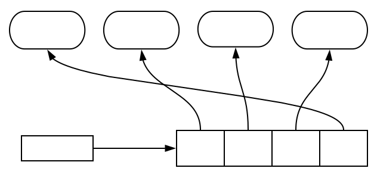
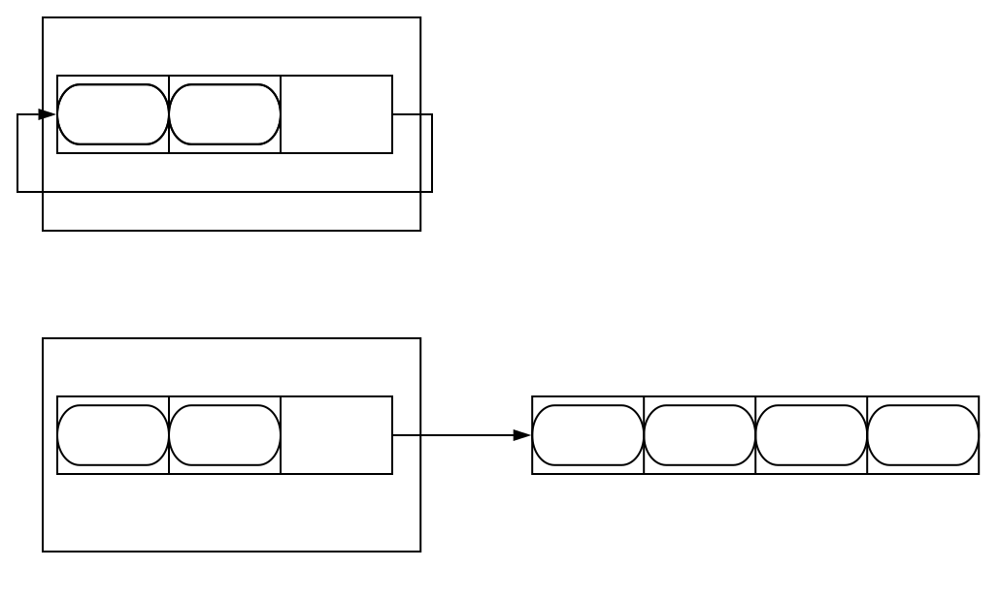

# Introductions

Dmitry
- EPFL PhD graduate
- Thesis on Design of Dotty(Scala 3)
- Founding member of Sorbet ~2 years ago
---

# Background

Note:

Don't say anything

---

## Stripe

- Platform that developers use to accept payments
- 32+ countries, millions of business worldwide
- Billions of dollars of processing volume annually
- More than 80%+ of American adults bought something on Stripe in 2017
- 1,700+ people in 10+ offices around the world
- We're hiring! → [stripe.com/jobs](https://stripe.com/jobs)

---

## Developer Productivity

- Testing
- Code
- Dev Env
- Abstractions
- Language Tools
- Docs
- Platform Teams
- Etc.

Note:

- Responsible from the moment you `git branch` until your code is in prod
- If a Stripe developer is having a bad day, it is our problem

---

## Ruby at Stripe

- Ruby is the primary programming language
  - Enforced subset of Ruby (Rubocop!)
  - Not using Rails
- Most product code is in a monorepo (intentionally!)
  - ~10 macroservices with a few microservices
  - New code mostly goes into an existing service

Note:

- Millions of lines of Ruby

---

## Scale of Engineering at Stripe

- Hundreds of engineers
- Thousands of commits per day
- Millions of lines of code

Note:

- Top languages
- Most product engineers use Ruby.
- Next language is 2% - bash

---

## Collaboration

- **Jeff Foster** (PLUM/Tufts) – RDL
- **@charliesome** (GitHub) – Ruby Parser
- **@soutaro** – Steep
- **@mame** – Type profiler
- **@matz** – BDFL of Ruby
- **Shopify**, **Coinbase**, **Sourcegraph**, **Kickstarter** – Sorbet contributors in open-source

Note:
- soutaro-san
- mame-san

---

## Open source!

- Yes!
- After an extensive ~3 month long beta with 30 companies
- https://sorbet.org


---

## Try it &#8681;

https://sorbet.run

</img>

---

# Why typecheck Ruby?

---

## Kickoff email

<style>
.reveal .email {
    text-align: left; 
    font-size: 18px;
}
.email div {
    padding: 20px 0;
}
.reveal .slides section .fragment.fade-out.visible {
    opacity: 1;
}
.reveal .email .emphasis {
    visibility: visible;
}
</style>
<div class="email">
<div class="fragment fade-out" style="padding: 0;">
<div>
Why add typechecking? In short, confidence. 
</div>

<div>
It <b class="emphasis">eliminates a whole class of errors</b>. How many NoMethodErrors do you think we
have a day? The answer may surprise you.
</div>
</div>

<div class="fragment fade-out">
We've seen it be very <b class="emphasis">successful in other languages</b> and companies. TypeScript
(Microsoft) and Flow (Facebook) for JavaScript. MyPy (Dropbox) for python. Hack
(Facebook) for PHP. Ruby is underinvested in by the community because few large
companies takes it as seriously as we do.
</div>

<div class="fragment fade-out">
Increased code mutability. We’ll be able to be much more <b class="emphasis">confident in our
codemods</b>, so that we will be able to keep our code a living, breathing, beast
instead of having pieces rot away.
</div>

<div class="fragment fade-out">
It makes you <b class="emphasis">think about your method interface</b> before writing. Do you take a
`Map<String, String>` or a `Array<Array<String>>`? This usually leads to more
composable code natively.
</div>

<div class="fragment fade-out">
It <b class="emphasis">makes code more readable</b>. Is a parameter named "merchant" a String merchant
ID, or an `Merchant` object? With type annotations, you never need to wonder
again.
</div>
</div>
---

# Fast

- ~100k lines/second/core in batch mode
- ~30ms end-to-end time for a single line programm
- ~5ms average incremental typecheck time on keypress in IDE
- ~50k lines/second/core on IDE startup

---

## Type System Design Principles

1. Explicit <!-- .element: class="fragment highlight-green" data-fragment-index="1" -->
2. Feel useful, not burdensome <!-- .element: class="fragment highlight-green" data-fragment-index="1" -->
3. As simple as possible, but no simpler <!-- .element: class="fragment highlight-green" data-fragment-index="1" -->
4. Compatible with Ruby
5. Scales <!-- .element: class="fragment highlight-green" data-fragment-index="1" -->
6. Adoptable gradually

---

## 1. Explicit

```ruby
sig {params(a: Integer).returns(String)}
def foo(a)
  a.to_s
end
```


Note:
  We're willing to write annotations, and in fact see them as
  beneficial; They make code more readable and predictable. We're here
  to help readers as much as writers.

---

## 2. Not burdensome: local inference

```ruby
sig {returns(String)} # Optional but not inferred
def foo
    a = 5 # Integer
    a = T.let("str", String) # String
end
```

Note:
 some people think that typesystems can be too verbose.
 We agree. This is why we want our to be concise.
 In particular here you don't need to specify type of variable a,
 we can infer that it is integer.

 If you do want to declare a type of variable, we you can do so with T.let.
 In this example, you re-assign a to a string and you explicitly daclare
 that you wanted a to become a string.

---

## 3. Simple but no simpler

  - Non-nullable types
  - Nominal gradual typesystem
  - Union and intersection types
  - Local type inference
  - Control-flow dependent typechecking
  - Generic classes & methods
  - Self types
  - Static & runtime typechecking


Note:
  Overall, we are not strong believers in super-complex type
  systems. They have their place, and we need a fair amount of
  expressive power to model (enough) real Ruby code, but all else
  being equal we want to be simpler. We believe that such a system
  scales better, and -- most importantly -- is easiest for users to
  learn+understand.

---

## 4. Scales

 - With team size
 - With number of teams that have different needs
 - With codebase size
   - Performance of <!-- .element: class="fragment highlight-green" data-fragment-index="1" -->
the tool itself
   - Keeping codebase complexity isolated
 - With time (not postponing hard decisions)

Note:   On all axes: in speed, team size, codebase size and time (not
  postponing hard decisions). We're already a large codebase, and will
  only get larger.

---

## Core datastructures:
 - GlobalState
 - SymbolRef
 - NameRef
 - 2 ASTs
 - CFG

---

## GlobalState

Represents knowledge about application being compiled:
 - what "names" have been used
 - what classes&methods exist and what properties do they have
 - logging & error reporting

---

## NameRef & SymbolRef

Effectively an index into Name/Symbol Table.
- Most common operation on Names & Symbols is comparison. Optimises for this,
- Names & symbols that typechecker needs to know about have statically known IDs
- Looking up information based on NameRef/SymbolRef is a sigle assembly instruction

---

```
if (name == core::Symbols::staticInit) 
// ^^^ common, easy to write

if (name.data(ctx)->shortName().startsWith("something")) 
// ^^^ rare, hard to write
```

Build API where:
 - common operations are fast and easy to use
 - slow methods are harder to call.

---

## Organization of phases:


</img>
---

## Index phases

- Do syntactic analysis
- Can't create Symbols
- Are cached & invalidated on per-file basis
- Don't have to be that fast
- Are an extention point, easy to contribute
- Parallel via "share nothing": every file has its own GlobalState
---

## Parser
 - is tasked with truthfully representing ruby syntax
 - was originally written by Github
 - builds a tree of Nodes with 99 kinds of nodes.
---

##  what node kinds does parser create?
<small>

| | | | | | | |
|-|-----------|-----------------|--------------|----------|-----------|-----------|
|Alias| Cbase     | EncodingLiteral | Integer      | Masgn    | Rational  | SplatLhs  |
|And| Class     | Ensure          | IVar         | Mlhs     | Redo      | String    |
|AndAsgn| Complex   | ERange          | IVarLhs      | Module   | Regexp    | Super     |
|Arg| Const     | False           | Kwarg        | Next     | Regopt    | Symbol    |
|Args| ConstLhs  | FileLiteral     | Kwbegin      | Nil      | Resbody   | True      |
|Array| CSend     | For             | Kwoptarg     | NthRef   | Rescue    | Undef     |
|Backref| CVar      | Float           | Kwrestarg    | OpAsgn   | Restarg   | Until     |
|Assign| CVarLhs   | GVar            | Kwsplat      | Or       | Retry     | UntilPost |
|Begin| DefMethod | GVarLhs         | LineLiteral  | OrAsgn   | Return    | When      |
| Block | Defined   | Hash            | LVar         | Optarg   | SClass    | While     |
| BlockArg | DefS      | Ident           | LVarAsgn     | Pair     | Self      | WhilePost |
| BlockPass | DString   | If              | LVarLhs      | Postexe  | Send      | XString   |
| Break | DSymbol   | IFlipflop       | MatchAsgn    | Preexe   | Shadowarg | Yield     |
| Case | EFlipflop | IRange          | MatchCurLine | Procarg0 | Splat     | ZSuper    |
| | | | | | | |
</small>

---
## Desugar

---
<small>

| | | | | | | |
|-|-----------|-----------------|--------------|----------|-----------|-----------|
|<div class="removed-node">Alias</div>| <div class="removed-node"> Cbase </div>     | <div class="removed-node">EncodingLiteral</div> | <div class="removed-node">Integer</div>      | <div class="removed-node">Masgn</div>    | <div class="removed-node">Rational</div>  | <div class="removed-node">SplatLhs</div>  |
|<div class="removed-node">And</div>| Class     | <div class="removed-node">Ensure</div>          | <div class="removed-node">IVar</div>         | <div class="removed-node">MLhs</div>     | <div class="removed-node">Redo</div>      | <div class="removed-node">String</div>    |
|<div class="removed-node">AndAsgn</div>| <div class="removed-node">Complex</div>   | <div class="removed-node">ERange</div>          | <div class="removed-node">IVarLhs</div>      | <div class="removed-node">Module</div>   | <div class="removed-node">RegExp</div>    | <div class="removed-node">Super</div>     |
|<div class="removed-node">Arg</div>| <div class="removed-node">Const</div>     | <div class="removed-node">False</div>           | Kwarg        | Next     | <div class="removed-node">RegOpt</div>    | <div class="removed-node">Symbol</div>    |
|<div class="removed-node">Args</div>| <div class="removed-node">ConstLhs</div>  | <div class="removed-node">FileLiteral</div>     | <div class="removed-node">Kwbegin</div>      | <div class="removed-node">Nil</div>      | <div class="removed-node">Resbody</div>   | <div class="removed-node">True</div>      |
|Array| <div class="removed-node">CSend</div>     | <div class="removed-node"> For</div>             | <div class="removed-node">Kwoptarg</div>     | <div class="removed-node"> NthRef</div>   | Rescue    | <div class="removed-node">Undef</div>     |
|<div class="removed-node">Backref</div>| <div class="removed-node">CVar</div>      | <div class="removed-node">Float</div>           | <div class="removed-node">Kwrestarg</div>    | <div class="removed-node">OpAsgn</div>   | Restarg   | Until     |
|Assign| <div class="removed-node">CVarLhs</div>   | <div class="removed-node">GVar</div>| <div class="removed-node">Kwsplat</div>    | <div class="removed-node">Or</div>       | Retry     | <div class="removed-node">UntilPost</div> |
|<div class="removed-node">Begin</div>| DefMethod | <div class="removed-node">GVarLhs</div>         | <div class="removed-node">LineLiteral</div>  | <div class="removed-node">OrAsgn</div>   | Return    | <div class="removed-node">When</div>      |
|Block| <div class="removed-node">Defined</div>   | Hash            | <div class="removed-node">LVar</div>         | Optarg   | <div class="removed-node">SClass</div>    | While     |
|Blockarg| <div class="removed-node">DefS</div>      | Ident           | <div class="removed-node">LVarAsgn</div>     | <div class="removed-node">Pair</div>     | Self      | <div class="removed-node">WhilePost</div> |
|<div class="removed-node">BlockPass</div>| <div class="removed-node">DString</div>   | If              | <div class="removed-node">LVarLhs</div>      | <div class="removed-node">Postexe</div>  | Send      | <div class="removed-node">XString</div>   |
|Break| <div class="removed-node">DSymbol</div>   | <div class="removed-node">IFlipflop</div>      | <div class="removed-node">MatchAsgn</div>    | <div class="removed-node">Preexe</div>   | Shadowarg | Yield     |
|<div class="removed-node">Case<div> | <div class="removed-node">EFlipflop</div> | <div class="removed-node">IRange    </div>      | <div class="removed-node">MatchCurLine | <div class="removed-node">Procarg0</div> | <div class="removed-node">Splat </div>    | ZSuper    |
|<div class="new-node">Field</div>|<div class="new-node"> LocalVariable</div>   | <div class="new-node">UnresolvedIdent</div>      | <div class="new-node">UnresolvedConstantLit</div>    | <div class="new-node">InsSeq</div>   | <div class="new-node">EmptyTree </div>| <div class="new-node"></div>     |
|| | | | | | |
</small>

---

## Desugar
  - building a less redundant syntax tree
  - generates a tree if ~31 kind of nodes
  - this is the IR that's easiest to work with

---

## DSL passess

- Handles Common library constructs that are common and are effectively language features.
 - getters & setters;
 - Ruby Structs
 - Stripe's typed Structs
- Easy to extend. In either C++ or Ruby

---

## Namer & Resolver phases

- Do definition discovery & class name resolution
- Are fast enough in practice(~300ms on a multiple-million line codebase)
- Mostly sequential
- Hard to contribute to, due to high performance requirements
---

##  Namer builds symboltable: SymbolTable
  - contains list of classes & methods that exist
    - where are they defined(file, line, character)
    - what's nested into them(e.g. methods nested in a class)
    - other information that describes a method/class
  - Sorbet lingo refers to :
    - classess, methods, blocks and arguments as `Symbols`
    - ID's of them as `SymbolRefs`
---
## Resolver
```
class A
  module B
  end
  B.foo
end
B.foo

module B
  def self.foo
  end
end
```
---
## Resolver

 - Replaces `UnresolvedConstantLit` nodes with `ConstantLit` nodes, that indicate what class symbol did you refer to
 - Gets rid of unresolved idents and replaces them with Field expressions.

---

## Expressions left after resolver
---

<small>

| | | | | | | |
|-|-----------|-----------------|--------------|----------|-----------|-----------|
|<div class="removed-node">Alias</div>| <div class="removed-node"> Cbase </div>     | <div class="removed-node">EncodingLiteral</div> | <div class="removed-node">Integer</div>      | <div class="removed-node">Masgn</div>    | <div class="removed-node">Rational</div>  | <div class="removed-node">SplatLhs</div>  |
|<div class="removed-node">And</div>| Class     | <div class="removed-node">Ensure</div>          | <div class="removed-node">IVar</div>         | <div class="removed-node">MLhs</div>     | <div class="removed-node">Redo</div>      | <div class="removed-node">String</div>    |
|<div class="removed-node">AndAsgn</div>| <div class="removed-node">Complex</div>   | <div class="removed-node">ERange</div>          | <div class="removed-node">IVarLhs</div>      | <div class="removed-node">Module</div>   | <div class="removed-node">RegExp</div>    | <div class="removed-node">Super</div>     |
|<div class="removed-node">Arg</div>| <div class="removed-node">Const</div>     | <div class="removed-node">False</div>           | <div class="removed-node-namer">Kwarg</div>        | <div class ="fragment highlight-blue" data-fragment-index="1">Next</div>     | <div class="removed-node">RegOpt</div>    | <div class="removed-node">Symbol</div>    |
|<div class="removed-node">Args</div>| <div class="removed-node">ConstLhs</div>  | <div class="removed-node">FileLiteral</div>     | <div class="removed-node">Kwbegin</div>      | <div class="removed-node">Nil</div>      | <div class="removed-node">Resbody</div>   | <div class="removed-node">True</div>      |
|Array| <div class="removed-node">CSend</div>     | <div class="removed-node"> For</div>             | <div class="removed-node">Kwoptarg</div>     | <div class="removed-node"> NthRef</div>   | <div class ="fragment highlight-blue" data-fragment-index="1">Rescue</div> | <div class="removed-node">Undef</div>     |
|<div class="removed-node">Backref</div>| <div class="removed-node">CVar</div>      | <div class="removed-node">Float</div>           | <div class="removed-node">Kwrestarg</div>    | <div class="removed-node">OpAsgn</div>   | <div class="removed-node-namer">Restarg </div>  | <div class ="fragment highlight-blue" data-fragment-index="1">Until</div> |
|Assign| <div class="removed-node">CVarLhs</div>   | <div class="removed-node">GVar</div>| <div class="removed-node">Kwsplat</div>    | <div class="removed-node">Or</div>       | <div class ="fragment highlight-blue" data-fragment-index="1">Retry</div>     | <div class="removed-node">UntilPost</div> |
|<div class="removed-node">Begin</div>| DefMethod | <div class="removed-node">GVarLhs</div>         | <div class="removed-node">LineLiteral</div>  | <div class="removed-node">OrAsgn</div>   | <div class ="fragment highlight-blue" data-fragment-index="1">Return</div>    | <div class="removed-node">When</div>      |
|Block| <div class="removed-node">Defined</div>   | Hash | <div class="removed-node">LVar</div>         | <div class="removed-node-namer">Optarg</div>   | <div class="removed-node">SClass</div>    | <div class ="fragment highlight-blue" data-fragment-index="1">While</div>     |
|<div class="removed-node-namer">Blockarg </div>| <div class="removed-node">DefS</div>      | Ident           | <div class="removed-node">LVarAsgn</div>     | <div class="removed-node">Pair</div>     | Self      | <div class="removed-node">WhilePost</div> |
|<div class="removed-node">BlockPass</div>| <div class="removed-node">DString</div>   | <div class ="fragment highlight-blue" data-fragment-index="1">If</div>              | <div class="removed-node">LVarLhs</div>      | <div class="removed-node">Postexe</div>  | Send      | <div class="removed-node">XString</div>   |
|<div class ="fragment highlight-blue" data-fragment-index="1">Break</div>| <div class="removed-node">DSymbol</div>   | <div class="removed-node">IFlipflop</div>      | <div class="removed-node">MatchAsgn</div>    | <div class="removed-node">Preexe</div>   | <div class="removed-node-namer">ShadowArg</div> | <div class ="fragment highlight-blue" data-fragment-index="1">Yield </div>     |
|<div class="removed-node">Case<div> | <div class="removed-node">EFlipflop</div> | <div class="removed-node">IRange    </div>      | <div class="removed-node">MatchCurLine | <div class="removed-node">Procarg0</div> | <div class="removed-node">Splat </div>    | <div class="removed-node-namer">ZSuper</div>    |
|Field|LocalVariable |<div class="removed-node">UnresolvedIdent</div> | <div class="removed-node">UnresolvedConstantLit </div> |<div class ="fragment highlight-blue" data-fragment-index="1">InsSeq</div> |EmptyTree|<div class="new-node">ConstantLit</div> |
|| | | | | | |
</small>

---

## Typecheck phases

- Build CFG and typecheck it
- Can't create Names or Symbols: works on immutable GlobalState
- Parallel via immutable sharing of GlobalState
- invalidated in case file or GlobalState changes
- Have to be reasonably fast
---

## CFG 

Instructions:

| | | |
|--------|-------------|-----------------|
| Alias  | BlockReturn | LoadYieldParams |
| Ident  | Literal     | Cast            |
| Send   | Self        |                 |
| Return | LoadArg     |                 |
||


Control-flow:

|   |
|-|
|If|
||

---



---

## CFG:

- removes all control flow but `if`s
- makes temporaries explicit
- keeps minimal number of instructions
- instructions can only refer to temporaries(unlike trees that contain other trees)
---
## Infer

- typechecks an instruction at a time
- maintains a mapping from temporary to it's type in-between instructions
- knows how to merge those mappings between blocks

---

# How do we test it?

---

## How do we test it?

Foundation: Sanity checks & sanitizers
1. smoke tests
2. test_corpus: programs that isolate features(or bugs)
3. monorepo
4. command line interface tests
5. fuzzing
---
## How do we test it: Sanity checks
</img>

---

## How do we test it: Sanity checks

- every datastructure has code to verify it's corretness
- many functions implement pre & post conditions
- those run in test and debug builds(and in -dev job)
- they don't run in prod
- we don't care how slow those are, we want them to be complete

---
</img>

---

## How do we test it: sanitizers

 - C++ is unsafe language(use after free, uninitialized memory, out-of-bounds access)
 - contemporary compilers support sanitizers that will insert checks for those behaviors
 - our test builds enable them(at cost of ~30x slowdown)

^^^

## Kinds of tests

^^^

##  How do we test it: Smoke tests

</img>
^^^
##  How do we test it: Smoke tests

 - most components define a few(<10) small tests that check that well-contained(serializers, bitpacking) functionality works
 - those small checks implement custom logic, but also run all the sanity checks
 - mostly used to find "if all tests fail, what's the actual broken thing"

^^^

## How do we test: test_corpus

 - for every feature/bug that we implement we add a ruby program that contains it
 - test can specify:
    - what errors should get reported on what lines
    - what should pretty printed state after specific phase look like
 - includes both valid and nonsense programs

^^^

## How do we test: monorepo

 - we pin version of Stripe monorepo in our repo
 - we typecheck it in the same way how typechecking in the monorepo job would run(with sanitizers and sanity checks) and make sure that no new errors are introduce
   - if new errors are introduced, we should fix them in the monorepo first
 - we used to additionally force typechecking of every file that isn't typed

^^^

## How do we test: command line interface tests

`test/cli/dash-e/dash-e.sh`:
```
#!/bin/bash
main/sorbet -e 'class Foo; end' -p name-table
```

`test/cli/dash-e/dash-e.out`:
```
  class ::Foo < ::Object () @ -e:1
  class ::<Class:Foo> < ::<Class:Object> () @ -e:1
```

^^^

## How do we test: command line interface tests
 - tests our actual output, depending on command line flags
 - tests exist codes
 - includes valid and invalid combinations of command line flags

---

## Why is it fast?
 - it's well tested and refactorable. Major changes are possible.
 - we knew what is going to be the bottleneck(memory accesses)
   - we measure to confirm our expectations
 - core internal APIs are designed with that bottleneck in mind
 - limitting what code has to be fast, easy extension in non-performance critical points.

---
# Two examples of designing for memory locality

---
# First: optimizing memory layout for most common operation
---

## Because of this, we have `SymbolRef`s (and `NameRef`s)

 - They only contain a single integer, that represents `id` in the SymbolTable
 - in order to access it's properties, you have to call `data(SymbolTable)` on it, that returns information you're looking for
 - This means that you much more rarely want reach slow operation(memory lookup in `data`)

---

# Second: optimized memory layour of containers

---

# How does Java Array store its elements?

---
</img>

<div class ="fragment" data-fragment-index="1"> 2 memory accesses needed</div>

---

# How does C++ Vector store its elements?

---

</img>

<div class ="fragment" data-fragment-index="1"> 1 memory access needed</div>

---

# How does InliedVector store its elements?

---

</img>
<div class ="fragment" data-fragment-index="1"> 0 memory access needed if size is smaller than a constant</div>

---

# Thank you!

<a href="mailto:sorbet@stripe.com">sorbet@stripe.com</a>

</img>

^^^

## Timeline

| Oct 2017 | Project kickoff
|-|-|
|| Try other type systems
|| Prototyping starts on C++
| Nov 2017 | Go/no-go date
|| Type Syntax
|| Type System
| Feb 2018 | First code typed manually
| Apr 2018 | <div class="fragment highlight-green">Rollout </div>

^^^
# What does the rollout mean?

 - Getting more people to choose to use Sorbet
 - Getting more files to `# typed: true`
 - Getting more callsites to be checked

^^^

</img>
^^^

# Reality:

- we are a small group of engineers
- we can't manually do the changes necessary for code to become typed

## We need tools<!-- .element: class="fragment"  -->
^^^

## Tools:
 - Bridge the gap between static analysis and runtime metraprogramming
 - Fix common bugs automatically
 - Find what can be typechecked easily
 - Find most impactful things to type
 - Suggest types to user

^^^

## Background: metraprogramming in Ruby

```ruby

def inject_method(claz, name, value)
  claz.define_method(name.to_sym) do
    value
  end
end

inject_method(Integer, "favorite_number", 42)

1.favorite_number
```

^^^

## Making dynamic definitions static

How do we make dynamic magic static:
* Load everything in Ruby -> Serialize reflection
* Load everything in Sorbet -> Serialize
* Load both -> Serialize diff
* For our code:
```console
$ wc -l sorbet/shims/autogenerated/missing_methods/*
 251105 total
```
* For 300+ libraries that we depend on  
```console
 $ wc -l sorbet/shims/autogenerated/gems/*
677478 total
```

^^^

##  Fix common bugs automatically

```console
foo.rb:311: Method strip does not exist on NilClass component 
            of T.nilable(String)
     311 |        status = match[1].strip.to_sym
                           ^^^^^^^^^^^^^^
  Autocorrect: Use `-a` to autocorrect
    foo.rb:311: Replace with T.must(match[1])
     311 |        status = match[1].strip.to_sym
                           ^^^^^^^^
```

^^^

## Find typecheckable files

```console
$ ./scripts/bin/typecheck --suggest-typed --typed=true
...
You could add `# typed: true` to: `foo/bar.rb`
You could add `# typed: true` to: `foo/baz.rb`
...
```

^^^

## Find impactful things to type
```ruby
def foo
 1
end

foo.bar.baz
```
 - In order to check calls to both `bar` and `baz` we need to get result type of `foo`;
 - we've build a tool that finds the most impactful methods to type

^^^

## Suggest type signatures
```ruby
def foo
  1
end
```

```console
guess-sig.rb:3: This function does not have a `sig` http://go/e/7017
    3 |def foo
       ^^^^^^^
  Autocorrect: Use `-a` to autocorrect
    guess-sig.rb:3: Add `sig.returns(Integer)`
```

Note:
  transition to Paul

^^^

## Timeline

| Feb 2018 | First sister-team
|-|-|
| Mar 2018 | First external user
| Apr 2018 | <div class="fragment highlight-green">Rollout</div>
| Jun 2018| Type most impactful functions
|| IDE
| Sept 2018 | Guessing of `sig`s <- NOW
| | De-magic-ing
| 2019 | Open Source

^^^

</img>

Note:
Code doubles roughly 2x each year

^^^

## Dark launch

* 60 days


^^^

## Give escape hatches

<pre style="box-shadow: none; font-size: 18px">
http://go/types

The ruby typechecker has found a possible error in your code.

If you believe this error is a false positive or is confusing or not
helpful, please let us know in <b class="fragment highlight-green">#ruby-types</b> or at ruby-types@stripe.com.

To run the <b class="fragment highlight-green">typechecker locally</b>, you can do any of:

- run `pay exec ./scripts/bin/typecheck`
- `pay start typecheck` then check your `pay up` window for errors
- run `./scripts/bin/lint` before committing

In addition, if you need to merge this code and don't want to or can't
figure out the type error, you can use one of these <b class="fragment highlight-green">workarounds</b> to
quiet the typechecker:

- Remove the `typed: true` comment from the files listed below.
- Wrap expressions in `T.unsafe(...)`. This function has no effect at
  runtime, and instructs the static checker to allow any or all method
    calls or operations on the resulting value.
</pre>

^^^

## Escape both ways

| | Runtime | Static |
|-|^^^------------------|
| `checked(false)` | X | ✓ |
| T.unsafe() | ✓ | X |

^^^

## Define metrics

* Percent of `typed: true` files
    * 0 -> 70% in 3 months
    * Group by error message
* Percent of method calls known
    * 25% -> 50% in 4 months
    * Group by Typed -> Untyped

Note:
25% came from typing the stdlib (which we graciously used from RDL)

^^^

## Typedness of files


^^^

## Calls resolved


^^^

## Human authored sigs


^^^

# Practical experience

Note:

Throwback to the title of our talk -- "a practical typechecker for
Ruby" -- and I want to link this to our experience at Stripe

These are some bugs we found in the process of rolling out the
typechecker, that slipped through CI and code review. Fortunately our
test coverage and processes are pretty good so none of these were
critical, but they are pretty informative of the experience of using
the tool and the kinds of issues we can catch.

- Examples are simplified but based on real code.

^^^

## Usage: dead code

```ruby
if Random.rand > 0.5
    foo = 1
else
    foo = 2
end
# foo is an Integer
```

<br/>

<div class="fragment">

```ruby
if Random.rand
    foo = 1
else
    foo = 2
end
```

```console
This code is unreachable
     6 |    foo = 2
                  ^
```

<div/>
Note:

  - We see that foo is assinged on both cases in first example
  - second example has a bug that could have been made by a C person.

^^^

## Typos in error handling

```ruby
    begin
      data = JSON.parse(File.read(path))
    rescue JSON::ParseError => e
      raise "#{PACKAGE_REL_PATH} contains invalid JSON: #{e}"
    end
```

```console
json.rb:6: Unable to resolve constant ParseError
    6 |  rescue JSON::ParseError => e
                ^^^^^^^^^^^^^^^^
   shims/gems/json.rbi:319: Did you mean: ::JSON::ParserError?
    319 |class JSON::ParserError < JSON::JSONError
         ^^^^^^^^^^^^^^^^^^^^^^^^^^^^^^^^^^^^^^^^^
```

^^^

## Errors in error handling

```ruby
   if look_ahead_days < 1 || look_ahead_days > 30
     raise ArgumentError('look_ahead_days must be between […]')
   end
```

```console
argumenterror.rb:9: Method ArgumentError does not exist on […]
```

Note:

Here we see another error inside an error-handling block. Someone
tried to call the function `ArgumentError`, instead of calling its
constructor -- perhaps they have been writing too much Python.

Here again we see that sorbert has identified the error and reported
that that method does not exist.

^^^

## `nil` checks

```ruby
app.post '/v1/webhook/:id/update' do
  endpoint = WebhookEndpoint.load(params[:id])
  update_webhook(endpoint, params)
end
```

```console
webhook.rb:16: Expression passed as an argument `endpoint`
    to method `update_webhook` does not match expected type
  16 |    update_webhook(webhook, params)
          ^^^^^^^^^^^^^^^^^^^^^^^^^^^^^^^

webhook.rb:10: Method update_webhook has specified type
    of argument endpoint as WebhookEndpoint
  Got T.nilable(WebhookEndpoint)
```

Note:

- strict nilability found a bug in an endpoint that handled an API
  request.
- This endpoint takes a Webhook ID from a user and updates it in our
  system
- the typechecker knows that `load` returns a webhook object or `nil`
  if that ID doesn't exist, and that `update_webhook` needs a
  non-`nil` webhook objecrt
- We detect the missing check

^^^

## `nil` checks (fixed)

```ruby
app.post '/v1/webhook/:id/update' do
  endpoint = WebhookEndpoint.load(params[:id])
  if endpoint.nil?
    raise UserError.new(:webhook_endpoint_not_found)
  end
  update_webhook(endpoint, params)
end
```

Note:

- Easy to fix; If we add the natural check you should have written
  anyways, we recognize the pattern and quiet the error

^^^

## Incorrect pattern matching

```ruby
  case transaction
      ...
      when Stripe::Charge || Stripe::Refund
      ...
  end
```


```console
case.rb:12: This code is unreachable
    12 |when Stripe::Refund || Stripe::Charge
                               ^^^^^^^^^^^^^^
```

Note:

Do a careful walk through

^^^


## User response

> Nice!! Beautiful errors and damn that was fast!!
> <!-- .element: class="smallquote"  -->

<span> </span>

> “DeveloperHappiness” would be a good name for ruby-typer
> <!-- .element: class="smallquote"  -->

<span> </span>

> I'm trying to use it locally, it's been super helpful to catch bugs in my own code.
> <!-- .element: class="smallquote"  -->

<span> </span>

> I introduced a typo with sed and ruby-typer caught it in CI within seconds of me pushing the branch.
> It’s really nice to get this kind of notification quickly rather than having to wait for potentially several minutes before the test job fails.
> <!-- .element: class="smallquote"  -->

^^^

## Closing
<style>
.reveal table.two-column td,
.reveal table.two-column th
{
   border-bottom: 0px; 
}
</style>

| Project kickoff | First sister-team
|-||-|
| Try other type systems | First external user
| Prototyping in C++ | Rollout
| Go/no-go date | Type impactful functions
| Type Syntax | IDE
| Type System | Guessing of `sig`s
| First code typed manually | De-magic-ing
|| Open Source
<!-- .element: class="two-column"  -->

^^^


## 5. Compatible with Ruby

  - Standard ruby syntax
  - Works with existing tools: editors, linters & etc

Note:
  In particular, we don't want new syntax. Existing Ruby syntax means
  we can leverage most of our existing tooling (editors, etc). Also,
  the whole point here is to improve an existing Ruby codebase, so we
  should be able to adopt it incrementally.

^^^

## 6. Adoptable gradually: strictness level

```ruby
#
# Basic checks such as syntax errors are enabled by default
```

<div class="fragment">

```ruby
# typed: true
# Enables type checking
```

<div/>

<div class="fragment">

```ruby
# typed: strict
# Additionally requires all method definitions to be typed
```

<div/>

<div class="fragment">

```ruby
# typed: strong
# The safest level: disallows calling untyped code
```

<div/>

Note:
-  In order to make adoption possible at scale, we cannot require all
-    the teams to adopt it at once, thus we need to support teams adopting it
-    at different pace.

^^^

## 6. Adoptable gradually: runtime typechecking

^^^

## Why have runtime typechecking?

- `A.rb`:
```ruby
# typed: true
sig {params(a: Integer).void}
def foo(a)
  ...
  ...
  ...
  ...
end
```

- `B.rb`:
```ruby
# typed: false
foo("1")
```

^^^
## Why have runtime typechecking?

- Untyped code can call into typed code
- Untyped code can perform stores that are read by typed code
- Typed code cannot protect itself because we will complain that the guard is dead


