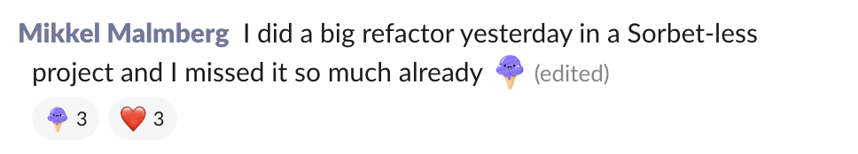
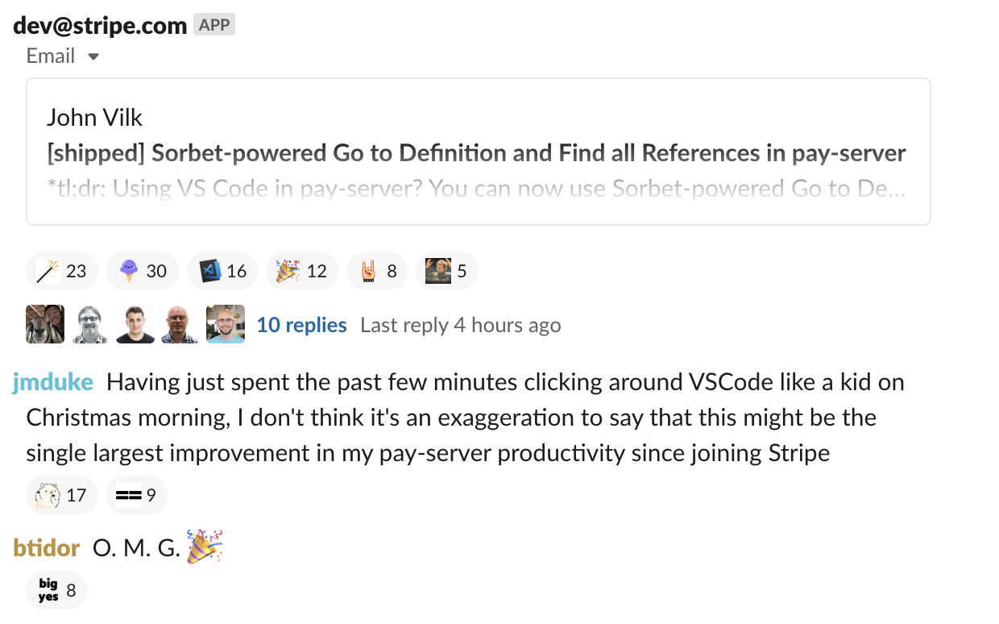

## What is Stripe?

&nbsp;

> Stripe is a software platform for running a business
> online.

---

## 🔎 About Stripe

- More than **2,000 employees**

- Engineers in San Francisco, Seattle, Dublin, Singapore,
  and more...

- **We're hiring!** (interns and full time)

---

## 🚀 Developer Productivity at Stripe

- "Break down obstacles to getting things done"

- Let our engineers focus on product

---

## Stripe uses Ruby extensively 💎

- Ruby is our primary programming language

- Hundreds of engineers

- Millions of lines of code (monorepo)

- Thousands of changes to the monorepo per day

---

## 🗣 What problems did we have?

Responses from biannual eng-wide survey:

1. Too long to get feedback

2. Too long to grasp unfamiliar code

3. Too easy to accidentally break things

---

## ➡️  What are our options?

- **Do nothing**: Opportunity cost (productivity, breakages)

- **Treat the symptoms of existing code**: New symptoms pop up

- **Rewrite everything**: 100s of engineers, all-or-nothing

- **Rewrite some things**: 10s(?) of engineers, partial impact

- **Type checker**: 3 engineers, incremental value in months

---

## ➡️  What are our options?

- <span style="opacity: 0.3;">**Do nothing**: Opportunity cost (productivity, breakages)</span>

- <span style="opacity: 0.3;">**Treat the symptoms of existing code**: New symptoms pop up</span>

- <span style="opacity: 0.3;">**Rewrite everything**: 100s of engineers, all-or-nothing</span>

- <span style="opacity: 0.3;">**Rewrite some things**: 10s(?) of engineers, partial impact</span>

- **Type checker**: 3 engineers, incremental value in months

---

## ...our answer: Sorbet 🎉

- **Oct 2017** – Kickoff

- **Feb 2018** – First typed code

- **June 2018** – Enforced in CI for every Stripe engineer

- <span style="opacity: 0.3;">... lots of other stuff ...</span>

- **Jun 2019** – Open source!

---

## The problems we wanted Sorbet to solve

1. Too long to grasp unfamiliar code

2. Too long to get feedback

3. Too easy to accidentally break things

<aside class="notes">
  <ul>
    <li>There were some recurring problems in the developer productivity survey</li>
    <li>Well meaning developers were finding it easy to break things</li>
  </ul>
</aside>

---

## 1. Too long to grasp unfamiliar code

```ruby
def self.find_card_similarity(merchant:)

  similarity_data = SimilarityDB.fetch(merchant)

  similarity_data ||= []

  process_similarity_data(similarity_data, merchant)
end
```

Hundreds of engineers means ~all code is unfamiliar

<aside class="notes">
  <ul>
    <li>Pulled from the stripe codebase</li>
    <li>Let's say we're debugging this method</li>
    <li>We really have no tools to understand it quickly</li>
  </ul>
</aside>

---

## 1. Too long to grasp unfamiliar code

```ruby
def self.find_card_similarity(merchant:)
  # Is `merchant` a string ID, or a Models::Merchant instance?
  similarity_data = SimilarityDB.fetch(merchant)

  similarity_data ||= []

  process_similarity_data(similarity_data, merchant)
end
```

Hundreds of engineers means ~all code is unfamiliar

<aside class="notes">
  <ul>
    <li>We can't tell what merchant is, as we're not interacting with it</li>
    <li>What if we want to change this code? Do we need to load the merchant
    first?</li>
  </ul>
</aside>

---

## 1. Too long to grasp unfamiliar code

```ruby
def self.find_card_similarity(merchant:)
  # Is `merchant` a string ID, or a Models::Merchant instance?
  similarity_data = SimilarityDB.fetch(merchant)
  # Is `similarity_data` ever actually falsy? Why?
  similarity_data ||= []

  process_similarity_data(similarity_data, merchant)
end
```

Hundreds of engineers means ~all code is unfamiliar

<aside class="notes">
  <ul>
    <li>Should we be handling a falsy return value?</li>
    <li>This is a small example, but it happens regularly in a large codebase</li>
  </ul>
</aside>

---

## 2. Too long to get feedback

- **All tests, locally**: days
- **All tests, in CI**: 10 – 20 minutes
- **One keystroke**: ~50 milliseconds

Already have massively parallel distributed CI test runner

<aside class="notes">
  <ul>
    <li>Stripe believes in test driven development</li>
    <li>We need to ensure that our code is behaving correctly</li>
    <li>Developer productivity has worked hard to get test results quickly, but
    it's still slow</li>
    <li>Recently this is improved, but it's still ~5 minutes</li>
    <li>We aspire to giving feedback on individual keystrokes</li>
  </ul>
</aside>

---

## 3. Too easy to break things

```ruby
def self.find_card_similarity(merchant:)
  # Is `merchant` a string ID, or a Models::Merchant instance?
  similarity_data = SimilarityDB.fetch(merchant)
  # Is `similarity_data` ever actually falsy? Why?
  similarity_data ||= []

  process_similarity_data(similarity_data, merchant)
end
```

"I want to change this code!"

... is it enough if the **tests** pass?

... is it enough if the QA / canary **deploys** have no errors?

<aside class="notes">
  <ul>
    <li>Imagine we want to change merchant to be an instance of the merchant
    class</li>
    <li>Are we confident we updated all calls of this method?</li>
  </ul>
</aside>

---

## 🤔 Does Sorbet fix these things?

<aside class="notes">
  <ul>
    <li>We made sorbet.run to allow people to experiment with sorbet</li>
    <li>This means that we can embed it in the slides and do a live demo</li>
  </ul>
</aside>

---

<iframe style="position: fixed; top: 0; right: 0; left: 0; bottom: 0; width: 100%; height: 100%;" src="https://sorbet.run/#%23%20typed%3A%20true%0A%0Amodule%20Risk%3A%3AMerchantSimilarity%0A%0A%0A%0A%0A%20%20def%20self.find_card_similarity(merchant%3A)%0A%20%20%20%20similarity_data%20%3D%20SimilarityDB.fetch(merchant)%0A%20%20%20%20similarity_data%20%7C%7C%3D%20%5B%5D%0A%0A%20%20%20%20result%20%3D%20process_similarity_data(similarity_data%2C%20merchant)%0A%20%20%20%20result%0A%20%20end%0A%0A%0A%0A%0A%0A%0A%0A%20%20sig%20do%0A%20%20%20%20params(%0A%20%20%20%20%20%20similarity_data%3A%20T%3A%3AArray%5BRawSimilarityData%5D%2C%0A%20%20%20%20%20%20merchant%3A%20String%0A%20%20%20%20)%0A%20%20%20%20.returns(SimilarityRecord)%0A%20%20end%0A%20%20def%20self.process_similarity_data(similarity_data%2C%20merchant)%0A%20%20%20%20raise%20%22Unimplemented%22%0A%20%20end%0Aend%0A%0Amodule%20Risk%3A%3AMerchantSimilarity%0A%20%20module%20SimilarityDB%0A%20%20%20%20%23%20Loads%20similarity%20data%20from%20the%20database%20for%20%60merchant%60%0A%20%20%20%20%23%0A%20%20%20%20%23%20Returns%20%60nil%60%20if%20no%20similarity%20data%20has%20been%20registered%20for%20this%20merchant%20yet.%0A%20%20%20%20sig%20%7Bparams(merchant%3A%20String).returns(T.nilable(T%3A%3AArray%5BRawSimilarityData%5D))%7D%0A%20%20%20%20def%20self.fetch(merchant)%0A%20%20%20%20%20%20raise%20%22Unimplemented%22%0A%20%20%20%20end%0A%20%20end%0Aend%0A%0A%0Amodule%20Risk%3A%3AMerchantSimilarity%0A%20%20class%20RawSimilarityData%20%3C%20T%3A%3AStruct%0A%20%20%20%20%23%20Unimplemented%0A%20%20end%0A%0A%20%20class%20SimilarityRecord%20%3C%20T%3A%3AStruct%0A%20%20%20%20prop%20%3Amerchant%2C%20Models%3A%3AMerchant%0A%20%20%20%20prop%20%3Aaccount_application%2C%20Models%3A%3AAccountApplication%0A%20%20%20%20prop%20%3Aintersection_count%2C%20Integer%0A%20%20end%0Aend%0A%0Aclass%20Models%3A%3AMerchant%0A%20%20%23%20Unimplemented%0Aend%0A%0Aclass%20Models%3A%3AAccountApplication%0A%20%20%23%20Unimplemented%0Aend%0A%0Aclass%20Module%0A%20%20include%20T%3A%3ASig%0Aend"></iframe>

<aside class="notes">
  <small>
    <ul>
      <li>Show hover for sig and docs, go to def</li>
      <li>Red squiggles on errors</li>
      <li>You can see docs on completion items</li>
      <li>Just as responsive on a large codebase</li>
      <li>Show tab to add a sig</li>
      <li>Sigs help refactor other code</li>
    </ul>
  </small>
</aside>

---

## Recap: Key benefits of Sorbet 💡

1. Too long to grasp unfamiliar code
  - → Types make code easier to grasp
2. Too long to get feedback
  - → Sorbet is as fast as you can type
3. Too easy to accidentally break things
  - → One more tool to reduce brittle code

<aside class="notes">
  <ul>
    <li>Types explain the expectations of methods</li>
    <li>Sorbet can give interactive feedback about the changes you're making</li>
    <li>Another great tool to help you gain confidence in your code</li>
  </ul>
</aside>

---

## 🎉 Ruby 3 & Types!

- Ruby 3 stdlib will ship with type definitions.

- We're collaborating closely with the Ruby core team

- See more details in talks by Matz, Yusuke Endoh and us @ RubyKaigi 2019

---

## Contributions 📈

- **1,100** pull requests commits since open source

- **152** total contributors
  - 10: current / former sorbet team
  - 36: Stripe employees
  - 106: non-Stripe employees

---

## Gem support

- 117 pull requests: types for Ruby stdlib

- 203 pull requests: types for gems

- 34 external contributors to [sorbet-typed]
  - 85% of commits from community contributors!

[sorbet-typed]: https://github.com/sorbet/sorbet-typed

---

## Related projects

- [sorbet-rails]
  - All-in-one support for Rails with Sorbet
- [Sord]
  - Generates Sorbet types from YARD annotations
- [Parlour]
  - Framework for writing Sorbet plugins

[sorbet-rails]: https://github.com/chanzuckerberg/sorbet-rails
[Sord]: https://github.com/AaronC81/sord
[Parlour]: https://github.com/AaronC81/parlour

---

## What people say

---


---



---



---

## What's next? 🚀

- Make it even faster

- Implement most-needed language features

- Invest heavily in editor tools (open source soon!)

---

## Try Sorbet today! 🎊

## [sorbet.run](https://sorbet.run)

---

# Thank you!
