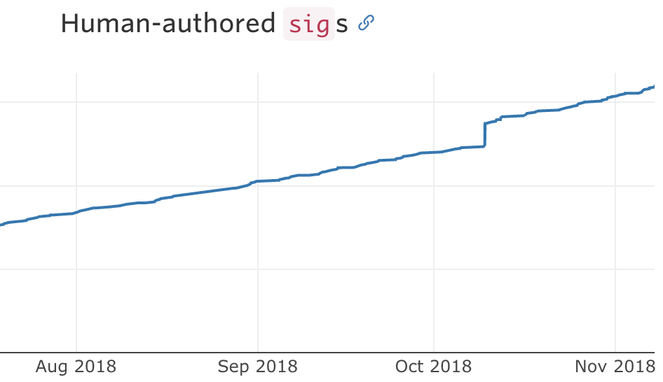
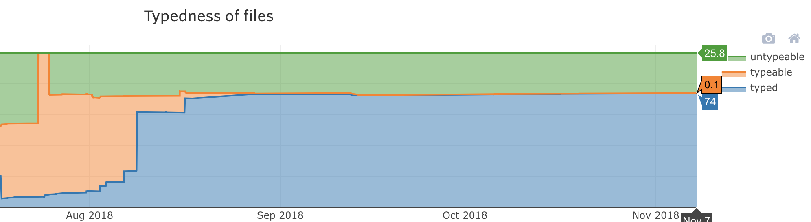
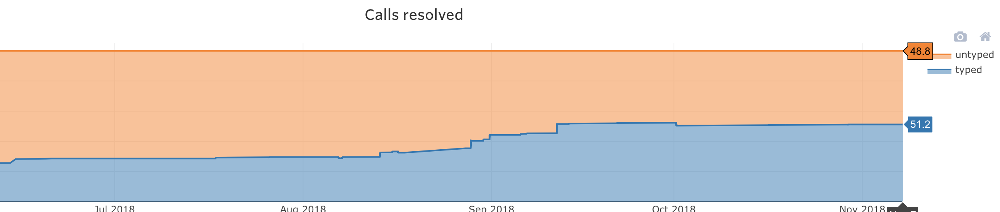

# Team effort

- **Dmitry**: PhD Compiler architecture & a bit of type theory @ next major version of Scala Compiler(3.0)
- **Nelson**: MIT grad, One of the longest tenured engineers at Stripe. Great knowledge of Ruby and MRI internals.
- **Paul**: Stanford grad, Previously at Facebook on HHVM and Hack
- **Jake**: joined team in August, a lot of experience with Flow and TypeScript
- we are currently hiring for this team.

---

## Outline

- Assumptions that Sorbet is developped under
- State of Sorbet at Stripe
- Evolution of Sorbet type system
- New things in Sorbet since last meeting

---

# Assumptions that Sorbet is developped under

Note: 
 - Sorbet is build with those constraints in mind.
 - Removing any of those constraints would have led us to different choices.

---

## Assumptions: MRI

 - Stripe runs on MRI and we value it
 - We do not intend to put effort into replacing it
 - Nor do we want to run a patched version.

---
## Assumptions: untyped code is here to stay

 - We do not intend to type early prototypes
 - We intend to interoperate with gems
 - We do not enforce typing on our users: they choose

---
## Assumptions: users choose strictness level

One of levels is "shut up". And it's the default.

Thus in order to get internal adoption, we needed to be useful with minimal initial investment effort

---
## Assumptions: gems exist and 
 - We allow building typed shims for gems, similar to ones used by Typescript
   - a very scalable way to collaborate and type the ecosystem

---
## Assumptions
- We could have got some of them wrong. We likely did.
- We already know a couple of areas where we plan to just let you tell us what to do:
  - we plan to implement structural types based on your asks
  - syntax: Matz, just tell us what you want - we'll support it.


---

# State of Sorbet at Stripe

---
## State of Sorbet at Stripe: Users

- Hundreds of users, who voluntarily use us every day.
- Different use-cases

---
## Use-cases: refactoring
</img> 

---
## Use-cases: interfaces
</img>

---
## Use-cases: exploration
</img> 

---
## Use-cases: debugging
</img> 

---
## Users
At this point:
 - the way many people expore code is: they type it;
 - before they modify existing code: they type it.


And that's not because we told them to, but because they find it easier to achive their goal with Sorbet as a tool.


---
## Users

</img>

---
## State of Sorbet at Stripe: Typed files
 - we have build ability to indicate what files can be typed into Sorbet
 - we have sent PRs to type all files to our users and allowed them to accept/reject it.

---
## State of Sorbet at Stripe: Typed files

</img>

---
## State of Sorbet at Stripe: Typed callsites
 - we've build a mode into sorbet that tells most impactful methods to type.
    - we typed a few hundred of most commonly used functions manually
 - (currently) we are building tools to type the long tail
    - dynamic type profiling
    - static analysis(see demo later)

---
## State of Sorbet at Stripe: Typed callsites

</img>

---
## State of Sorbet at Stripe

Over last 6 month, Sorbet was rapidly adopted at Stipe:
 - users are happy and feel that it's useful for them
 - \>75% of files are being typechecked
 - \>50% of callsites in those files are checked for correctness

---
# History of the type system

---
## What principles did we start with

Take the minimal thing, and start adding features based on patters that we see in our codebase.

---
## First pattern: control flow sensitivity

simple case:
```ruby
  def test_return(s)
    if s.nil?
      return 0
    end

    s.length
  end
```

---
## Control flow sensitivity

more contrieved example:
```ruby
def orZero(a)
  b = !a.is_a?(Integer)
  if b
    0
  else
    a
  end
end
```

---

## Second pattern: generic classes

```ruby
Array["1", "2", "3"].each{|s| some_method(s)}
```

---

## Generic system that we chose:

- I worked on Scala generics before. Though they didn't fit.
- Amoung generic systems, I feel like the one in C# first Ruby best
- We went with C#-ish generics, but with runtime erasure
- We support co-, contra- and in- variance
- We support reducing kindness (e.g. `File` is a `IO<String>` and thus has different kind than parent)

---

## Generic methods

```ruby
Array["1", "2", "3"].map{|s| Integer(s) }
```

---
## Generic system that we chose:
 - type variables & type constraints for upper & lower bounds
 - minimal constraint solver tried on our usage of Ruby library
 - "just works" in experience of our users: having huge number of examples helped tremendously. 

---
## Self types
 - Introduced to model `Object#dup` and similar methods

---

# Major changes since last meeting

---
## Supporting (most) metaprogramming

We've built a script that finds all metaprogrammed classes and functions:

- we load all code into MRI
- we use runtime introspection to see what classes exist & what method they define
- will store those definitions in a shim file
- will substract set of files that Sorbet sees from this shim file.

---

## Auto-fixes for common errors

---

```
foo[0]
```

```
test/suggest_t_must.rb:4: Method `[]` 
does not exist on `NilClass` component of `T.nilable(String)`
     4 |foo[0]
        ^^^^^^
  Autocorrect: Use `-a` to autocorrect
    test/	suggest_t_must.rb:4: Replace with `T.must(foo)`
     4 |foo[0]
        ^^^
```

---

## AutoLoader

- 3 years ago Stripe has given a talk on How to Load 1m Lines of Ruby in 5s:  https://www.youtube.com/watch?v=lKMOETQAdzs
- It is was based on pre-computation of dependencies in Ruby
- In order for this precoputation to run in ~1m it had a lot of atrisinal caching and optimizations
- Sorbet  replaced old static analysis, generating the same data in mere seconds


---

## Signatures are lazy.

---

```
class A
 extend T::Helpers
 sig(b: B).returns(B) # NameError: forward reference to B. 
 def foo(b); b; end;
end

class B
 extend T::Helpers
 sig(a: A).returns(A)
 def bar(a); a; end;
end
```

---

```
class A
 extend T::Helpers
 sig{params(b: B).returns(B)} # safe!
 def foo(b); b; end;
end

class B
 extend T::Helpers
 sig{params(a: A).returns(A)}
 def bar(a); a; end;
end
```

---

## Suggesting signatures
 - dynamic type profiling
 - static analysis

---

## Suggesting signatures: type profiling

Idea: Instrument code in production, see what types are passed, log them, aggregate them.

---
## Suggesting signatures: type profiling

- Pros: can ascribe some time to every function that was ever executed
- Cons: builds over-precise types. e.g  for 
```
def isChristmas; ...; end
```

---

## Suggesting signatures: static analysis

Idea: see what _could_ be returned from the method, and what requirements should arguments satisfy for the method to typecheck

---
## Suggesting signatures: static analysis

- Pros: is conservative. The types that it retuns are correct. Currently, can 3x number of signatures that we have.
- Cons: could be more general than the actual usage of method. e.g. for
```
def addStrings(a, b); a + b; end;
```

---
## Suggesting signatures

- Neither approach is perfect
- We're currently building both
- The plan is to:
   - use runtime profiling and manually verify some singatures
   - and the propagate them with static analys.

---

## Demo:


---
## Our Questions:

  - Do our decisions looks reasonable? 
  - What do you think we should change to fit requirements that you have better?

---

# Thank you!

<a href="mailto:sorbet@stripe.com">sorbet@stripe.com</a>

</img>

Note:

- Thank you to the conference organizers for letting us speak here today. 
- Thanks Ruby for the great language that we all build on.
- With that, thank you so much for listening to us and taking that.
- Arigatou gozaimasu
