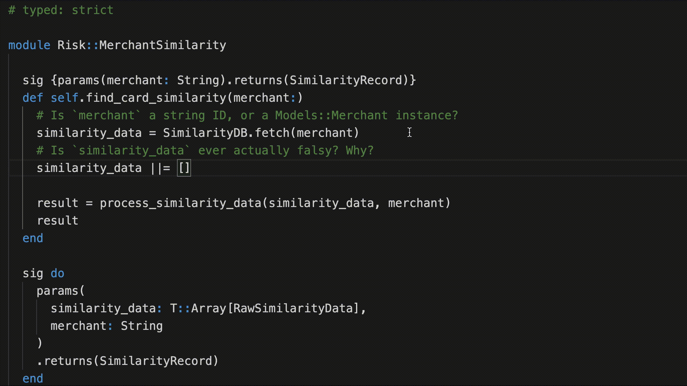
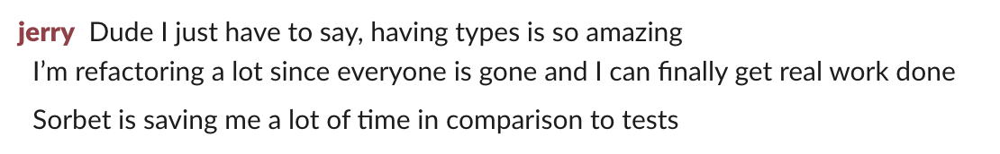
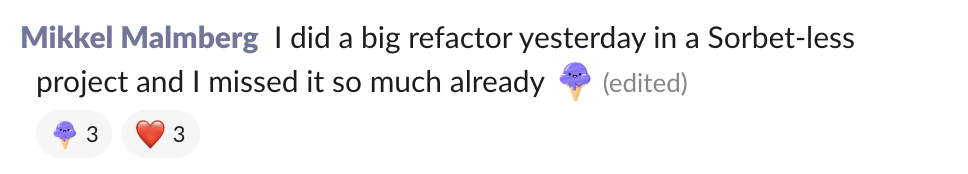
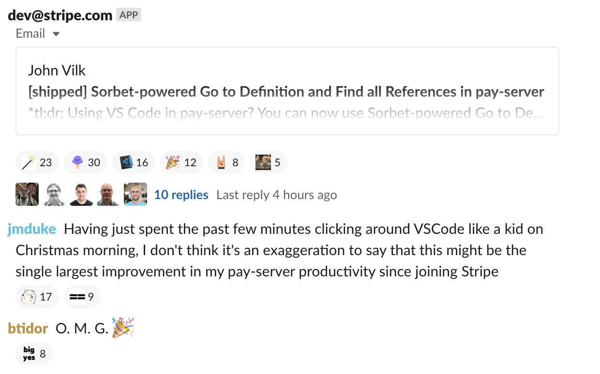

# Sorbet

## A type checker for Ruby 3 you can use today!


<br>

---

TODO team members / contributors

---

- **About Stripe**

- Why we built a type checker for Ruby

- The growing Sorbet community

---

## What is Stripe? 🤔

&nbsp;

> Stripe is a software platform for running a business
> online.

Note:

Startups you've never heard of as well as huge companies
like Facebook and Lyft use our APIs to accept payments from
anywhere and run their business online.

We really try to remove the barriers that make it hard to
start and operate a business. Our long term goal is to
increase the size of the internet economy because our
software has made it so much easier to run a business
online.

**Favorite part**: our users are developers

---

## 🔎 About Stripe

- More than **2,000 employees**

- More than 250 million API requests per day<br>
  (peak of **13,000 requests a second**)

- Engineers in San Francisco, Seattle, Dublin, Singapore,
  and more...

- **We're hiring!** (interns and full time)

Note:

Come chat with us after!

---

## Context: Developer Productivity ✨

- "Break down obstacles to getting things done"

- Avoid thinking about incidental complexity

Note:

- Local dev flow
- CI
- Universal abstractions / libraries
- Work with not against the tools
- Impact multiplier

---

## Context: Ruby at Stripe 💎

- Ruby is our primary programming language

- Hundreds of engineers

- Millions of lines of code

- Thousands of changes to the monorepo per day

---

- About Stripe

- **Why we built a type checker for Ruby**

- The growing Sorbet community

---

## 🗣 Context: Dev Productivity Survey

Responses from biannual eng-wide survey:

1. Too long to get feedback

2. Too long to grasp unfamiliar code

3. Too easy to accidentally break things

Note:

Run surveys every 6 months to find common pain points

---

## 1. Too long to get feedback

- **One keystroke**: ~50 milliseconds
- **All tests, in CI**: 10 – 20 minutes
- **All tests, locally**: days

Already have massively parallel distributed CI test runner

Note:

If you know the tests that might fail, you can run those
locally (~seconds – ~minutes).

But a huge strength of a monorepo is confidence from running
**all** the tests.

---

## 2. Too long to grasp unfamiliar code

```ruby
def self.find_card_similarity(merchant:)

  similarity_data = SimilarityDB.fetch(merchant)

  similarity_data ||= []

  process_similarity_data(similarity_data, merchant)
end
```

Hundreds of engineers means ~all code is unfamiliar


---

## 2. Too long to grasp unfamiliar code

```ruby
def self.find_card_similarity(merchant:)
  # Is `merchant` a string ID, or a Models::Merchant instance?
  similarity_data = SimilarityDB.fetch(merchant)

  similarity_data ||= []

  process_similarity_data(similarity_data, merchant)
end
```

Hundreds of engineers means ~all code is unfamiliar


---

## 2. Too long to grasp unfamiliar code

```ruby
def self.find_card_similarity(merchant:)
  # Is `merchant` a string ID, or a Models::Merchant instance?
  similarity_data = SimilarityDB.fetch(merchant)
  # Is `similarity_data` ever actually falsy? Why?
  similarity_data ||= []

  process_similarity_data(similarity_data, merchant)
end
```

Hundreds of engineers means ~all code is unfamiliar

---

## 3. Too easy to break things

"I want to delete this code!"

... is it enough if the **tests** pass?

... is it enough if the QA / canary **deploys** have no errors?

Note:

Some code paths only tested monthly! (Subscriptions)

Some code paths only tested yearly! (Taxes)

---

## 💡 The language is an obstacle

Note:

Sometimes the survey feedback is clearly Stripe-specific
problems, but these weren't Stripe-specific.

---

## ➡️  What are our options?

- **Do nothing**: Opportunity cost (productivity, breakages)

- **Treat the symptoms**: New symptoms pop up

- **Rewrite everything**: 100s of engineers, all-or-nothing

- **Rewrite some things**: 10s(?) of engineers, partial impact

- **Type checker**: 3 engineers, incremental value in months

---

## ➡️  What are our options?

- <span style="opacity: 0.3;">**Do nothing**: Opportunity cost (productivity, breakages)</span>

- <span style="opacity: 0.3;">**Treat the symptoms**: New symptoms pop up</span>

- <span style="opacity: 0.3;">**Rewrite everything**: 100s of engineers, all-or-nothing</span>

- <span style="opacity: 0.3;">**Rewrite some things**: 10s(?) of engineers, partial impact</span>

- **Type checker**: 3 engineers, incremental value in months

---

## ... so we built Sorbet 🎉

- **Oct 2017** – Kickoff

- **Feb 2018** – First typed code

- **June 2018** – Enforced in CI for every Stripe engineer

- <span style="opacity: 0.3;">... lots of other stuff ...</span>

- **Jun 2019** – Open source!

Note:

Incremental value in months with only 3 people.

Rest of company didn't have to change or stop using Ruby.

---

## 🤔 How did Sorbet do?

Wanted to improve these things:

1. Too long to get feedback

2. Too long to grasp unfamiliar code

3. Too easy to accidentally break things

---

## 1. Too long to get feedback?

- **One keystroke**: < 50 milliseconds
- **Sorbet, in editor**: 50ms – 80ms
- **Sorbet, command line**: 20 seconds
- **All tests, in CI**: 10 – 20 minutes
- **All tests, locally**: days

&nbsp;

---

## → Sorbet is as fast as you can type

- <span style="opacity: 0.3;">**One keystroke**: < 50 milliseconds</span>
- **Sorbet, in editor**: 50ms – 80ms
- **Sorbet, command line**: 20 seconds
- <span style="opacity: 0.3;">**All tests, in CI**: 10 – 20 minutes</span>
- <span style="opacity: 0.3;">**All tests, locally**: days</span>

This is for Stripe's multi-million line Ruby monorepo!

---

## 2. Too long to grasp unfamiliar code?

```ruby

def self.find_card_similarity(merchant:)
  # Is `merchant` a string ID, or a Models::Merchant instance?
  similarity_data = SimilarityDB.fetch(merchant)

  similarity_data ||= []

  process_similarity_data(similarity_data, merchant)
end
```

---

## → Types make code easier to grasp

```ruby
sig {params(merchant: String).returns(SimilarityRecord)}  # <- it's a string 👍
def self.find_card_similarity(merchant:)
  # Is `merchant` a string ID, or a Models::Merchant instance?
  similarity_data = SimilarityDB.fetch(merchant)

  similarity_data ||= []

  process_similarity_data(similarity_data, merchant)
end
```

---

## → Types make code easier to grasp

```ruby
sig {params(merchant: String).returns(SimilarityRecord)}
def self.find_card_similarity(merchant:)
  # Is `merchant` a string ID, or a Models::Merchant instance?
  similarity_data = SimilarityDB.fetch(merchant)
  # Is `similarity_data` ever actually falsy? Why?
  similarity_data ||= []

  process_similarity_data(similarity_data, merchant)
end
```


---

<a href="https://sorbet.run/#%23%20typed%3A%20strict%0A%0Amodule%20Risk%3A%3AMerchantSimilarity%0A%0A%20%20sig%20%7Bparams(merchant%3A%20String).returns(SimilarityRecord)%7D%0A%20%20def%20self.find_card_similarity(merchant%3A)%0A%20%20%20%20%23%20Is%20%60merchant%60%20a%20string%20ID%2C%20or%20a%20Models%3A%3AMerchant%20instance%3F%0A%20%20%20%20similarity_data%20%3D%20SimilarityDB.fetch(merchant)%0A%20%20%20%20%23%20Is%20%60similarity_data%60%20ever%20actually%20falsy%3F%20Why%3F%0A%20%20%20%20similarity_data%20%7C%7C%3D%20%5B%5D%0A%0A%20%20%20%20result%20%3D%20process_similarity_data(similarity_data%2C%20merchant)%0A%20%20%20%20result%0A%20%20end%0A%0A%20%20sig%20do%0A%20%20%20%20params(%0A%20%20%20%20%20%20similarity_data%3A%20T%3A%3AArray%5BRawSimilarityData%5D%2C%0A%20%20%20%20%20%20merchant%3A%20String%0A%20%20%20%20)%0A%20%20%20%20.returns(SimilarityRecord)%0A%20%20end%0A%20%20def%20self.process_similarity_data(similarity_data%2C%20merchant)%0A%20%20%20%20raise%20%22Unimplemented%22%0A%20%20end%0Aend%0A%0Amodule%20Risk%3A%3AMerchantSimilarity%0A%20%20module%20SimilarityDB%0A%20%20%20%20%23%20Loads%20similarity%20data%20from%20the%20database%20for%20%60merchant%60%0A%20%20%20%20%23%0A%20%20%20%20%23%20Returns%20%60nil%60%20if%20no%20similarity%20data%20has%20been%20registered%20for%20this%20merchant%20yet.%0A%20%20%20%20sig%20%7Bparams(merchant%3A%20String).returns(T.nilable(T%3A%3AArray%5BRawSimilarityData%5D))%7D%0A%20%20%20%20def%20self.fetch(merchant)%0A%20%20%20%20%20%20raise%20%22Unimplemented%22%0A%20%20%20%20end%0A%20%20end%0Aend%0A%0A%0Amodule%20Risk%3A%3AMerchantSimilarity%0A%20%20class%20RawSimilarityData%20%3C%20T%3A%3AStruct%0A%20%20%20%20%23%20Unimplemented%0A%20%20end%0A%0A%20%20class%20SimilarityRecord%20%3C%20T%3A%3AStruct%0A%20%20%20%20prop%20%3Amerchant%2C%20Models%3A%3AMerchant%0A%20%20%20%20prop%20%3Aaccount_application%2C%20Models%3A%3AAccountApplication%0A%20%20%20%20prop%20%3Aintersection_count%2C%20Integer%0A%20%20end%0Aend%0A%0Aclass%20Models%3A%3AMerchant%0A%20%20%23%20Unimplemented%0Aend%0A%0Aclass%20Models%3A%3AAccountApplication%0A%20%20%23%20Unimplemented%0Aend%0A%0Aclass%20Module%0A%20%20include%20T%3A%3ASig%0Aend">



</a>

Note:

Click for live demo

---

## → People think about their APIs

```ruby
sig {params(merchant: String).returns(SimilarityRecord)}
def self.find_card_similarity(merchant:)
  # Is `merchant` a string ID, or a Models::Merchant instance?
  similarity_data = SimilarityDB.fetch(merchant)
  # Is `similarity_data` ever actually falsy? Why?
  similarity_data ||= []

  process_similarity_data(similarity_data, merchant)
end
```

- "Maybe I should take a `Merchant` instead of a `String`"

- "Maybe I should return `[]` instead of `nil`"

---

## 3. Too easy to break things?

"I want to delete this code!"

... is it enough if the **tests** pass?

... is it enough if the QA / canary **deploys** have no errors?

&nbsp;

---

## → Harder to break things

"I want to delete this code!"

... is it enough if the **tests** pass?

... is it enough if the QA / canary **deploys** have no errors?

... **also**: is it enough if it typechecks?

Note:

Sorbet runs **fast** and on the **whole codebase**.


---

## Recap: Key benefits of Sorbet 💡

1. Sorbet is as fast as you can type

2. Types make code easier to grasp

3. Harder to accidentally break things

---

- About Stripe

- Why we built a type checker for Ruby

- **The growing Sorbet community**

---

## 🎉 Ruby 3 & Types!

- Ruby 3 stdlib will ship with type definitions

- We're collaborating closely with the Ruby core team

---

## Contributions 📈

- **800** total commits since open source

- **90** total contributors
  - 10: current / former sorbet team
  - 30: Stripe employees
  - 50: non-Stripe employees

---

## Open source contributions

- **@alexsnaps**
  - Parser support for Ruby 2.5
- **@iliabylich**
  - Parser support for Ruby 2.6
- **@univerio**
  - Docs for Ruby stdlib into Sorbet's RBIs

... and many more!

---

## Gem support

- 117 commits: types for Ruby stdlib

- 114 commits: types for gems

- 23 external contributors to [sorbet-typed]
  - 85% of commits from community contributors!

[sorbet-typed]: https://github.com/sorbet/sorbet-typed

Note:

fun fact: dmitry doesn't have a single commit to
sorbet-typed :P

---

## Related projects

- [sorbet-rails]
  - All-in-one support for Rails with Sorbet
- [Sord]
  - Generates Sorbet types from YARD annotations
- [Parlour]
  - Framework for writing Sorbet plugins

[sorbet-rails]: https://github.com/chanzuckerberg/sorbet-rails
[Sord]: https://github.com/AaronC81/sord
[Parlour]: https://github.com/AaronC81/parlour

---

## What people say

---



---



---



---

TODO roadmap / what's next / goals

call to action of some sort?


---

## What's next? 🚀

- Invest heavily in editor tools

- Make it even faster

- Implement most-needed language features

---

# Questions❓

---

## Thanks for coming!

- We're hiring ([stripe.com/jobs](https://stripe.com/jobs))

- Feel free to chat with us after


<!-- vim:tw=60
-->
