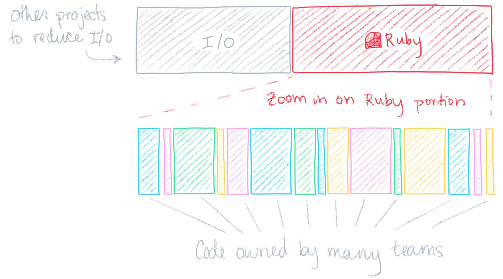
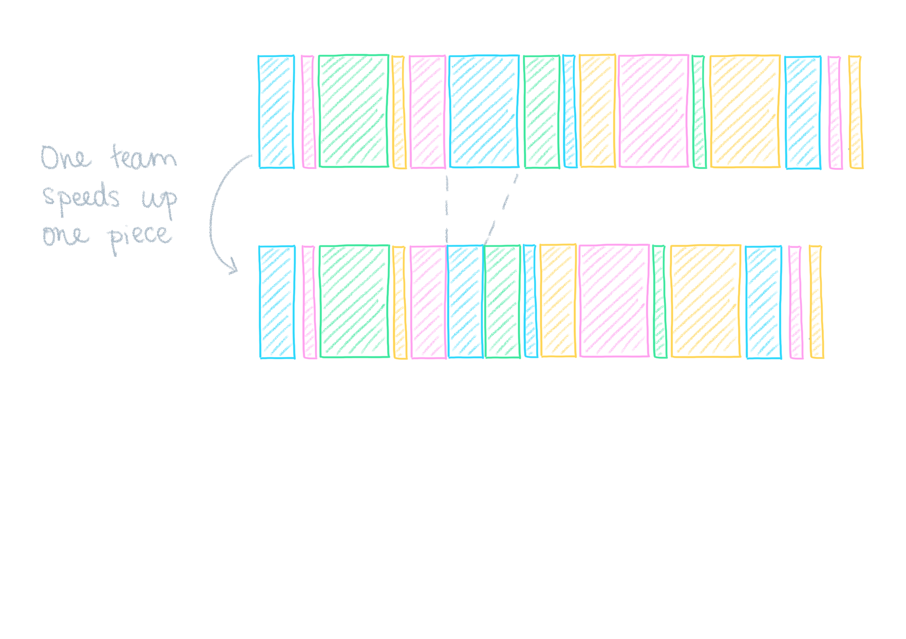
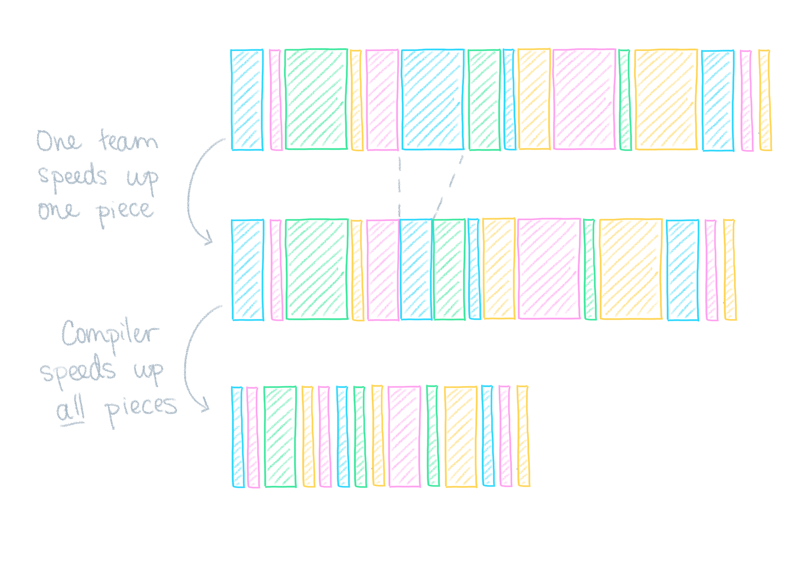
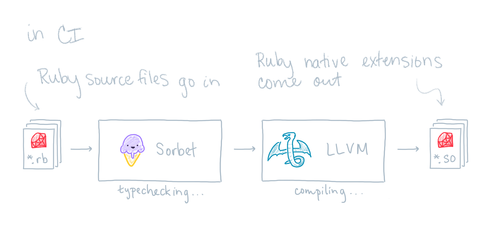
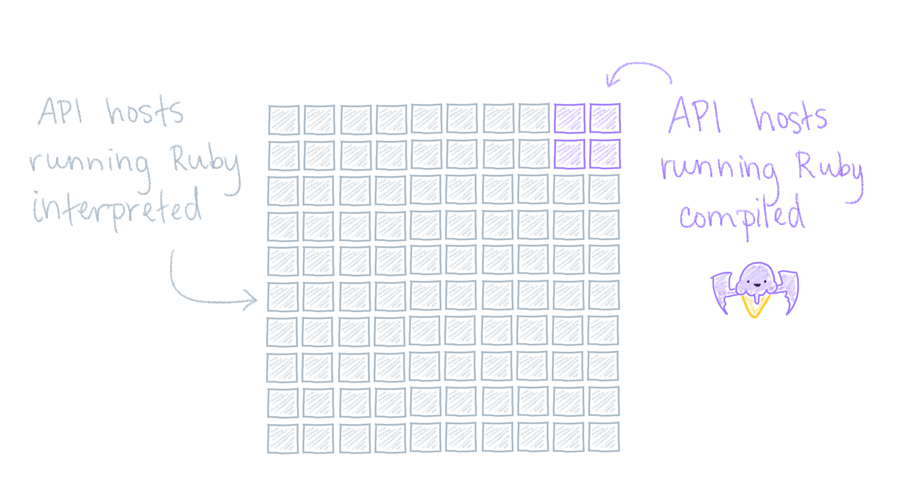
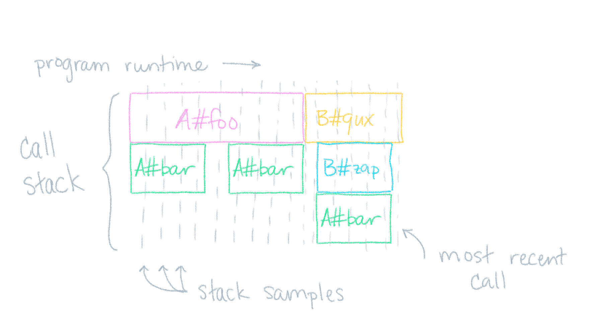
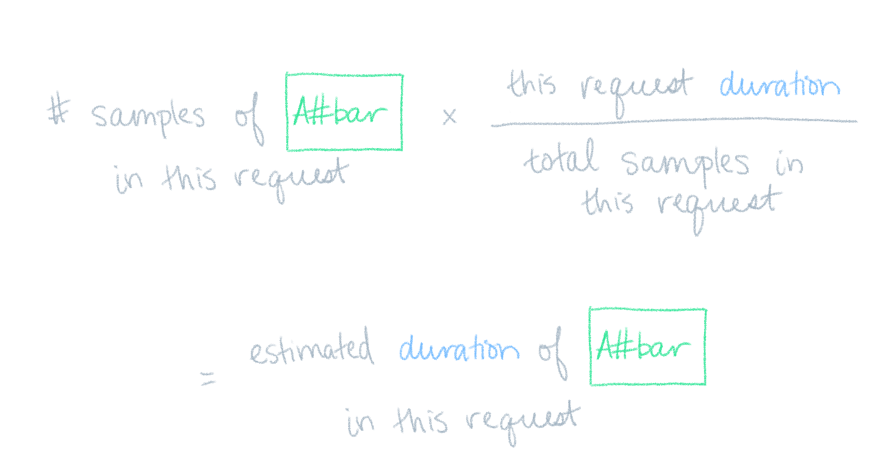

##

- Why does Stripe care about performance?

- Why build a compiler for Ruby?

- How does it work?

- How are we adopting it?


##

- **Why does Stripe care about performance?**

- Why build a compiler for Ruby?

- How does it work?

- How are we adopting it?


## 📈 Stripe is an API for building a business

- Accept payments
- Coordinate payouts
- Manage taxes
- ...

::: notes

Product for pretty much everything that has to do with your
business's money needs.

:::


## API latency is a feature ✨

- Stripe users want **lower latency**

- Stripe API runs on every checkout

::: notes

You're going to choose the faster API over the slower API if they're otherwise equal.

:::


##

- Why does Stripe care about performance?

- **Why build a compiler for Ruby?**

- How does it work?

- How are we adopting it?


## 💎 Stripe uses **Ruby** extensively

- Powers our most important services (Stripe API)

- Hundreds of engineers use Ruby daily

- Millions of lines of code (monorepo)

- Massive type coverage with Sorbet


## Visualizing API Latency


::: notes

I/O is sizable, but is being tackled by other projects—compiler focuses on Ruby

:::


## Visualizing API Latency




::: notes

Ruby portion is owned by dozens of teams

:::

##


##



::: notes

generous: hottest files take <1% of request duration

:::

##



::: notes

"if the compiler works, it has the potential to speed up all
pieces"

high-leverage

:::

## Why AoT, not JIT?

**AoT**: ahead-of-time\
**JIT**: just-in-time

- Sorbet types speed up generated code

- AoT are simpler (implement, debug)

- Can still do both!

## Why not TruffleRuby or JRuby?

- No incremental migration

- Compiler works with existing Ruby VM

::: notes

targets Ruby C extensions

:::


##

- Why does Stripe care about performance?

- Why build a compiler for Ruby?

- **How does it work?**

- How are we adopting it?

::: notes

transition to trevor

:::

<!-- why do we expect a compiler to work for Ruby a priori? -->
<!-- nathan has bits about this in the nonvergence talk -->

## Sorbet

<!-- surprising that sorbet was not mentioned very much, or that it was so late in the pipeline -->

- A typechecker for ruby with a powerful static analysis pass
- A gradual type system, allowing users to locally opt-out of type checking

## Sorbet Example

```{.ruby}
sig do
  params(x: T::Array[Integer])
  .returns(T::Array[Integer])
end
def f(x)
  x.map {|v| v + 1}
end
```

## Catching a type error

```{.ruby .hl-6}
sig do
  params(x: T::Array[Integer])
  .returns(T::Array[Integer])
end
def f(x)
  x.map {|v| v + 1}.to_s # static error!
end
```

::: notes

We introduced an error by producing an array of strings instead of an array of integers, and sorbet flags this statically

:::

## LLVM

- A toolkit that powers many compilers today
- clang, ghc, swift, …

## Sorbet + LLVM = Sorbet Compiler

- Sorbet, augmented with an additional pass to generate LLVM IR
- LLVM is used to generate native code

::: notes

Our type annotations help LLVM to generate better code.

Runtime type-checks are coalesced to both reduce the amount of typechecking at runtime, and enable more aggressive inlining.

:::

## Compiling the example

```{.ruby}
sig do
  params(x: T::Array[Integer])
  .returns(T::Array[Integer])
end
def f(x)
  x.map {|v| v + 1}
end
```

::: notes

We'll use some pseudo-code to illustrate the transformations the compiler will apply

:::

## Leveraging types (the compiler's view)

```{.ruby .hl-2 .hl-4}
def f(x)
  raise unless x.is_a?(Array)
  t = x.map {|v| v + 1}
  raise unless t.is_a?(Array)
  t
end
```

::: notes

The signature is checked unconditionally at runtime, and produce assumptions for us to reuse later. Parameter and return value validation moves into the function body.

The check for `x` is now specialized to `Array`.

The return value has been named, and its runtime type-check is also specialized to `Array`.

:::

## Leveraging types (the compiler's view)
```{.ruby .hl-3}
def f(x)
  raise unless x.is_a?(Array)
  t = x.map {|v| v + 1}
  raise unless t.is_a?(Array)
  t
end
```


::: notes

* At this point we know that `x` is an `Array`, and can dispatch to a faster implementation of `map`

:::

## Leveraging types (skipping the vm to call map directly)

```{.ruby .hl-3}
def f(x)
  raise unless x.is_a?(Array)
  t = rb_ary_collect(x) do |v|
    v + 1
  end
  raise unless t.is_a?(Array)
  t
end
```

::: notes

* This is hand-wavy: setting up the block for the call to `rb_ary_collect` takes more work than this

:::

## Leveraging types (inlining the definition of map)

```{.ruby}
def f(x)
  raise unless x.is_a?(Array)
  t = []; i = 0; len = x.length
  while i < len
    t << <callblock>(x[i]) {|v| v + 1}
    i += 1
  end
  raise unless t.is_a?(Array)
  t
end
```

::: notes

* We can inline the definition of `rb_ary_collect` constructing the array directly instead

:::

## Leveraging types (inlining the block)

```{.ruby}
def f(x)
  raise unless x.is_a?(Array)
  t = []; i = 0; len = x.length
  while i < len
    t << x[i] + 1
    i += 1
  end
  raise unless t.is_a?(Array)
  t
end
```

::: notes

* There's no longer any need for the block to be called, and we can inline it in the body of the loop

:::

## Leveraging types (removing additional method calls)
```{.ruby .hl-3 .hl-5}
def f(x)
  raise unless x.is_a?(Array)
  t = []; i = 0; len = x.length
  while i < len
    t << x[i] + 1
    i += 1
  end
  raise unless t.is_a?(Array)
  t
end
```

::: notes

* We can further inline other calls to methods on `x`, inlining the calls to `length` and `[]`, and the `<<` method on `t`

:::

## Leveraging types (removing redundant type tests)

```{.ruby .hl-8}
def f(x)
  raise unless x.is_a?(Array)
  t = []; i = 0; len = x.length
  while i < len
    t << x[i] + 1
    i += 1
  end
  raise unless t.is_a?(Array)
  t
end
```

::: notes

* We know that `t` will always be an array, so we can remove the check on the return value

:::

## Final version

<!-- TODO(trevor) make it clear that the compiler is not source-to-source -->

```{.ruby}
def f(x)
  raise unless x.is_a?(Array)
  t = []; i = 0; len = x.length
  while i < len
    t << x[i] + 1
    i += 1
  end
  t
end
```

::: notes


:::

##

<!-- TODO(trevor) maybe move this earlier, before example -->



<!--  -->


::: notes

the "LLVM" part is only like extra 15k lines

:::

## Requirements of source

<!-- will people even know what typed: sigils are? -->

- Must be **`# typed: true`** or higher
- Must enable **`# frozen_string_literal: true`**
- Must be marked **`# compiled: true`**

::: notes

Sorbet doesn't generate a CFG for `typed: false` and lower files.

We intern string constants.

This last point is subtle: we opt-in to compilation on a per-file basis.

:::

## Code Generation

<!-- can we roll this whole section into just pointing out LLVM in the picture? -->

<!-- this was the first mention of CFG, wasn't really clear what that means? -->

- LLVM IR is generated from a typechecked CFG
- The code generation pass and runtime support adds about 15k lines of code

::: notes

The 15k lines are 5k of runtime support and 10k of actual code-generation pass.

:::

## Modifying the ruby VM

<!-- focus on "we have support code that we link into the VM for convenience" more than "we arbitrarily modify the VM"

- Expose more symbols for runtime linking
- Add a new sorbet calling convention for methods compiled by sorbet

::: notes

We need to expose previously hidden methods, `rb_ary_compact_bang` for example, so that we can call them directly when appropriate

* Reasons for the sorbet calling convention
  * speed up method calls with keyword args
  * move common method frame setup code into the vm

:::

## Loading compiled code

- Stripe already monkey patches require for our autoloader
- Let’s use that monkey patch to also make the decision about loading a shared objects

## Deploying Compiled Code

<!-- potential cut? -->

- We make changes frequently to the vm, and re-deploying to hosts wasn’t an acceptable solution
- What about bundling ruby into the deployment artifacts?

::: notes

* Re-deploying ruby to hosts each time we made a change would be onerous and would significantly decrease development velocity on the compiler

:::

## Deploying Compiled Code (Additional benefits)

- Canarying ruby upgrades is much simpler now
- We run tests with the same patched vm in CI that goes out to production

::: notes

After getting compiled code running in production, our next step was to validate our hypothesis by profiling the running compiled code. Jake will describe what went into setting all of that up at Stripe.

:::


##

- Why does Stripe care about performance?

- Why build a compiler for Ruby?

- How does it work?

- **How are we adopting it?**

::: notes

switch to jez

:::


## Adopting in production

<!-- TODO(jez) we test in CI too, not only in production -->

1. Compare performance on real traffic
2. Must be incremental
3. Plan for when things go wrong

<!-- mature company, have existing guardrails -->

::: notes

incremental == iteration speed

:::

## Real traffic, small blast radius




## Stackprof in production 👷‍♂️

<!-- this might be in the weeds. maybe just mention stackprof and move on -->
<!-- uses standard ruby tools--compiler just works with all this stuff -->




::: notes

Record contents of stack periodically

Use existing Ruby tools!

Reuse another team's work (to measure interpreted code)

Bunch of things we can do with this information

:::

## 🏆 Compile incrementally, most important first


::: notes

Compiling file with `A` is more important than `B`
(B always calls into `A` anyways)

Rank all files required by importance to production

Low effort, high reward

"Should we implements support for X or Y first?"

:::

## Estimate latency of single method ⚖️



::: notes

Did we make `A#bar` faster or slower?

:::

## ⏱ Track how much of request runs compiled


## Plan for when things go wrong 😱


::: notes

1. Flip a feature flag (no code change, build, no deploy)
2. All compiled code off in under 30 seconds

Rest of the organization is happy with us experimenting

:::

## What's next?

<!-- should we have a slide here explaining why we're not talking about numbers? -->
<!-- "this is what we're getting out of it" -->

<!-- we've learned a lot about how to build fast C extensions, and we're eager to chat with people about potential modifications to the Ruby C API that would make C extensions more powerful and also allow the compiler to be faster -->

- Increase adoption (fraction running compiled)
- Profile and optimize (improve compiled performance)
- Keep time-to-compile low (developer productivity)

## Questions? 🙋

:::: {.columns}

::: {.column width="50%"}
*btw, we have stickers!*

{height="150px"}
{height="150px"}
:::

::: {.column width="50%"}
*also, we're hiring!*

→ [stripe.com/jobs](https://stripe.com/jobs)
:::
::::


\


