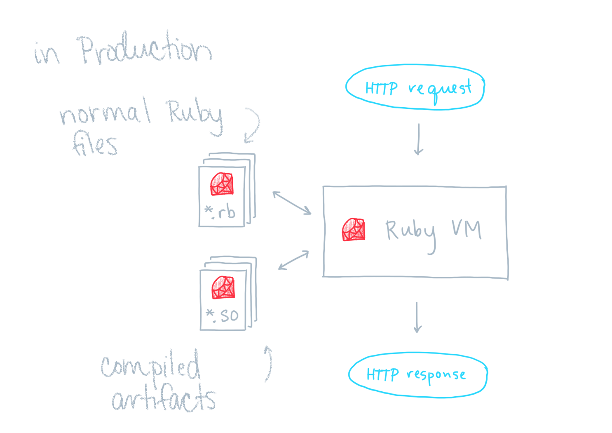
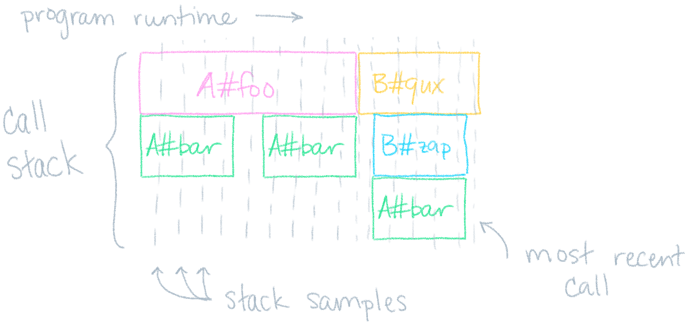

##

:::: {.columns style="text-align: center;"}

::: {.column width="20%"}
{height="175px"}

Sorbet
:::

::: {.column width="7%"}

\

### +

:::

::: {.column width="33%"}
{height="175px"}

LLVM
:::

::: {.column width="7%"}

\

### =

:::

::: {.column width="33%"}
{height="175px"}

the Sorbet Compiler
:::

::::

::: notes

"For those who don't know..."

:::

## Agenda

- Why does Stripe care about performance?

- Why build a compiler for Ruby?

- How does it work?

- How are we adopting it?


## Agenda

- **Why does Stripe care about performance?**

- Why build a compiler for Ruby?

- How does it work?

- How are we adopting it?


## 📈 Stripe is an API for building a business

- Accept payments
- Coordinate payouts
- Manage taxes
- ...

::: notes

Product for pretty much everything that has to do with your
business's money needs.

:::


## API latency is a feature ✨

- Stripe users want **lower latency**

- Stripe API runs on every checkout

::: notes

You're going to choose the faster API over the slower API if they're otherwise equal.

:::


## Agenda

- Why does Stripe care about performance?

- **Why build a compiler for Ruby?**

- How does it work?

- How are we adopting it?


## 💎 Stripe uses **Ruby** extensively

- Powers our most important services (Stripe API)

- Hundreds of engineers use Ruby daily

- Millions of lines of code (monorepo)

- Massive type coverage with Sorbet


## Visualizing API Latency


::: notes

I/O is sizable, but is being tackled by other projects—compiler focuses on Ruby

:::


## Visualizing API Latency


::: notes

Ruby portion is owned by dozens of teams

:::

##


##


::: notes

generous: hottest files take <1% of request duration

:::

##


::: notes

"if the compiler works, it has the potential to speed up all
pieces"

high-leverage

:::

## Why AoT, not JIT?

**AoT**: ahead-of-time\
**JIT**: just-in-time

- Sorbet types speed up generated code

- AoT are simpler (implement, debug)

- Can still do both!

## Why not TruffleRuby or JRuby?

- No incremental migration

- Compiler works with existing Ruby VM

::: notes

targets Ruby C extensions

:::


## Agenda

- Why does Stripe care about performance?

- Why build a compiler for Ruby?

- **How does it work?**

- How are we adopting it?

::: notes

transition to trevor

:::

<!-- why do we expect a compiler to work for Ruby a priori? -->
<!-- nathan has bits about this in the nonvergence talk -->

##

<!-- TODO(trevor) maybe move this earlier, before example -->


<!--  -->


::: notes

A typechecker for ruby with a powerful static analysis pass built by Stripe

A gradual type system, allowing users to locally opt-out of type checking

:::

## Sorbet Example

```{.ruby}
sig do
  params(x: T::Array[Integer])
  .returns(T::Array[Integer])
end
def f(x)
  x.map {|v| v + 1}
end
```

## Catching a type error

```{.ruby .hl-6}
sig do
  params(x: T::Array[Integer])
  .returns(T::Array[Integer])
end
def f(x)
  x.map {|v| v + 1}.to_s # static error!
end
```

::: notes

We introduced an error by producing an array of strings instead of an array of integers, and sorbet flags this statically

:::

##

<!-- TODO(trevor) maybe move this earlier, before example -->


<!--  -->


::: notes

LLVM is used by many compilers: clang, ghc, swift...

LLVM IR is generated from a typechecked ruby program

The code generation pass adds about 10k lines of c++, runtime support adds 5k lines of c

:::

## Compiling the example

```{.ruby}
sig do
  params(x: T::Array[Integer])
  .returns(T::Array[Integer])
end
def f(x)
  x.map {|v| v + 1}
end
```

::: notes

We'll use some pseudo-code to illustrate the transformations the compiler will apply

Note that the compiler is not source-to-source, this example is just to give an
idea of the sorts of transformations the compiler applies

:::

## Leveraging types (the compiler's view)

```{.ruby .hl-2 .hl-4}
def f(x)
  raise unless x.is_a?(Array)
  t = x.map {|v| v + 1}
  raise unless t.is_a?(Array)
  t
end
```

::: notes

The signature is checked unconditionally at runtime, and produce assumptions for us to reuse later. Parameter and return value validation moves into the function body.

The check for `x` is now specialized to `Array`.

The return value has been named, and its runtime type-check is also specialized to `Array`.

:::

## Leveraging types (skipping the vm to call map directly)

```{.ruby .hl-3}
def f(x)
  raise unless x.is_a?(Array)
  t = rb_ary_collect(x) do |v|
    v + 1
  end
  raise unless t.is_a?(Array)
  t
end
```

::: notes

At this point we know that `x` is an `Array`, and can dispatch directly to the implementation of `map`

This is hand-wavy: setting up the block for the call to `rb_ary_collect` takes more work than this

:::

## Leveraging types (inlining the definition of map)

```{.ruby}
def f(x)
  raise unless x.is_a?(Array)
  t = []; i = 0; len = x.length
  while i < len
    t << <callblock>(x[i]) {|v| v + 1}
    i += 1
  end
  raise unless t.is_a?(Array)
  t
end
```

::: notes

We can inline the definition of `rb_ary_collect` constructing the array directly instead

:::

## Leveraging types (inlining the block)

```{.ruby}
def f(x)
  raise unless x.is_a?(Array)
  t = []; i = 0; len = x.length
  while i < len
    t << x[i] + 1
    i += 1
  end
  raise unless t.is_a?(Array)
  t
end
```

::: notes

There's no longer any need for the block to be called, and we can inline it in the body of the loop

:::

## Leveraging types (removing additional method calls)
```{.ruby .hl-3 .hl-5}
def f(x)
  raise unless x.is_a?(Array)
  t = []; i = 0; len = x.length
  while i < len
    t << x[i] + 1
    i += 1
  end
  raise unless t.is_a?(Array)
  t
end
```

::: notes

* We can further inline other calls to methods on `x`, inlining the calls to `length` and `[]`, and the `<<` method on `t`

:::

## Leveraging types (removing redundant type tests)

```{.ruby .hl-8}
def f(x)
  raise unless x.is_a?(Array)
  t = []; i = 0; len = x.length
  while i < len
    t << x[i] + 1
    i += 1
  end
  raise unless t.is_a?(Array)
  t
end
```

::: notes

* We know that `t` will always be an array, so we can remove the check on the return value

:::

## Final version

```{.ruby}
def f(x)
  raise unless x.is_a?(Array)
  t = []; i = 0; len = x.length
  while i < len
    t << x[i] + 1
    i += 1
  end
  t
end
```

::: notes

Re-iterate that this is not a source-to-source transformation

:::

## Agenda

- Why does Stripe care about performance?

- Why build a compiler for Ruby?

- How does it work?

- **How are we adopting it?**

::: notes

switch to jez

:::


## Goals for adoption

<!-- TODO(jez) we test in CI too, not only in production -->

1️⃣ Plan for when things go wrong

2️⃣ Compare performance on real traffic

3️⃣ Must be incremental


<!-- mature company, have existing guardrails -->

::: notes

incremental == iteration speed

:::

## 1️⃣ Plan for when things go wrong

- Compiler test cases

- Entire Stripe test suite

- Pre-production (staging environment)

- Blue/green deploys

- Separate host set to kill traffic fast

::: notes

multiple lines of defense

:::

## 2️⃣ Performance on real traffic


## 3️⃣ Must be incremental

→ Measure with **Stackprof**




::: notes

Compiling file with `A` is more important than `B`

Existing Stackprof tooling!

:::

## What's next? 💭

<!-- should we have a slide here explaining why we're not talking about numbers? -->
<!-- "this is what we're getting out of it" -->

<!-- we've learned a lot about how to build fast C extensions, and we're eager to chat with people about potential modifications to the Ruby C API that would make C extensions more powerful and also allow the compiler to be faster -->

📈 **Increase adoption**\
　 (fraction running compiled)

⏱ **Profile and optimize**\
　 (improve compiled performance)

⏳ **Keep time-to-compile low**\
　 (developer productivity)

::: notes

note quite worth sharing concrete performance numbers yet, because we've been
focused on adoption

:::

## Questions? 🙋

:::: {.columns}

::: {.column width="50%"}
*btw, we have stickers!*

{height="150px"}
{height="150px"}
:::

::: {.column width="50%"}
*also, we're hiring!*

→ [stripe.com/jobs](https://stripe.com/jobs)
:::
::::


\


