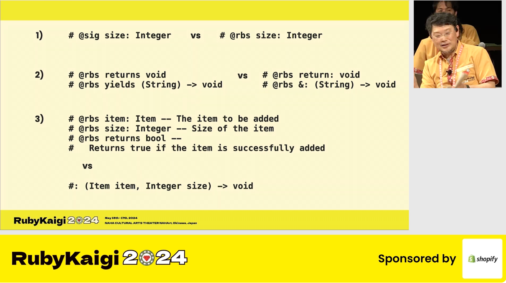

-----

<h1 class="title">Past, Present, and Future of Sorbet Type Syntax</h1>

::::{.columns}
:::{.column width="27%"}
Jake Zimmerman
:::
:::{.column width="73%"}
![][github-mark-light]![][github-mark-dark][`@jez`]
:::
::::

[April 23, 2025]{.date}

[`@jez`]: https://github.com/jez

[github-mark-light]: img/light/github-mark.svg {style="height:30px; margin: 0 0.3em -5px;"}
[github-mark-dark]: img/dark/github-mark.svg {style="height:30px; margin: 0 0.3em -5px;"}

-----

## Sorbet's syntax is bad

- verbose
- foreign
- doesn't feel like Ruby

## **Semantics** > **Syntax**

- **semantics**: what the types mean
- **syntax**: how you write the types

Semantics are about conveying the thoughts in your head

##

:::: {.columns}
::: {.column style="text-align: center;"}
{style="max-height: 329px; margin:
0 auto;"}
:::
::::

_Cueball, likely getting sucked into a debate about type
syntax._

[(source)](https://xkcd.com/386/)

## This talk is for Sorbet users

Agenda:

- The historical context at Stripe
- The goals and constraints
- Various problems we discovered
- Potential future changes

## About me

::::{.columns}
:::{.column width="40%" style="text-align: center;"}
{style="max-width: 72px;"}

**`:jez-type-safety:`**
:::

:::{.column width="55%"}
- Jake Zimmerman ![][github-mark-light]![][github-mark-dark][`@jez`]

- working on Sorbet for almost 7 years

- at Stripe since 2016/2017
:::
::::

## The before times

mid 2017: ~**750** people, ~**300** engineers

Responses to survey on developer productivity (pick three):

1.  Better technical documentation
1.  Static type checking for Ruby
1.  Unattended deploys
1.  CI flakiness on feature branch builds
1.  CI flakiness on master builds
1.  Async programming primitives and libraries
1.  Seamlessly start multiple services in development
1.  GUI for running database migrations

## Write-in answers

"What are the top 1-2 things we could do to make you more productive?"

> mono-repoing all the things; better, more intuitive
> code/documentation (**clearer interfaces**, **static
> typing**, stronger assurances from linting)

> **static types** / less magic in [Stripe's Ruby codebase]

> builds being faster, tests on branches passing meaning you
> wont break master, **static types** in [Stripe's Ruby
> codebase]

## **Misconception**: "how to convince users?"

\

It wasn't part of the project to convince people to want
static typing.

...They convinced us!

## c. 2013

{style="max-height: 500px;"}

## c. 2013

{style="max-height: 500px;"}

##

```ruby
class Animal < Chalk::Interface
  method :hello
end

class Dog
  include Chalk::Interface::Implementation
  def hello = bark
  def bark = "hello"

  implements Animal
end
```

```{.ruby .hl-1 .hl-4}
animal = Animal.from_instance(Dog.new)
animal.bark # 💥
dog = Chalk::Interface.dynamic_cast(animal, Dog)
dog.bark    # ✅
```

##

{style="max-height: 500px;"}

##

{style="max-height: 500px;"}

## Approaches to static typing

The team evaluated various approaches:

- 🙅‍♂️ Rewriting to a typed language\
  → Too much work

- 🙅‍♂️ [RDL]\
  → Not static enough

- 🙅‍♂️ [TypedRuby]\
  → Buggy

[RDL]: https://github.com/tupl-tufts/rdl
[TypedRuby]: https://github.com/typedruby/typedruby

✅ **write our own** from scratch

## **The TypeScript approach**: compile them away

Breaks compatibility

- TypeScript: gave up "save file, reload page" ages ago

- Ruby: no one uses transpilers

linters, syntax highlighting, code formatting, backtraces,
IDEs would all break

prevents gradual adoption by open source community

## **The header file approach**: like RBS today

- Everyone builds it eventually, but complementary

- "Only separate files" is not enough: you need **inline
  type assertions**

Unique selling point: complete freedom in syntax design

## **The JSDoc approach**: types in comments

Comments are static only...\
Stripe wanted **static AND runtime**!

\

> With a sufficient number of users of an API,\
> it does not matter what you promise in the contract:\
> all observable behaviors of your system\
> will be depended on by somebody.

*— [Hyrum's Law](https://www.hyrumslaw.com/)*

##

```{.ruby}

def get_mcc(charge, merchant)
  return charge.mcc if charge
  merchant.default_mcc


end
```

##

```{.ruby}

def get_mcc(charge, merchant)


  return charge.mcc if charge
  merchant.default_mcc
end
```

##

```{.ruby .hl-3 .hl-4}

def get_mcc(charge, merchant)
  override = merchant.override_mcc
  return override if override

  return charge.mcc if charge
  merchant.default_mcc
end
```

##

```{.ruby .hl-1}
sig { params(charge: Charge, merchant: Merchant).returns(MCC) }
def get_mcc(charge, merchant)
  override = merchant.override_mcc
  return override if override

  return charge.mcc if charge
  merchant.default_mcc
end
```

## **The DSL approach**: `declare_methdod` becomes `sig`

```{.ruby .hl-1}
sig { params(x: Integer).returns(String) }
def example
  x.to_s
end
```

## **The Python approach**: first-party type hints

```python
def foo(a: expression, b: expression = 5):
    ...

foo.__annotations__
```

Started as **Function Annotations**

Later standardized **Type Hints** using **Function
Annotations**

## Pros & Cons of Type Hints

Pros

- feels at home with other parts of the language
- flexibility to allow runtime checking
- tools don't need to write a parser to consume them

Cons

- requires a parser change
- requires that people agree on the convention (hard to know
  who's using annotations specifically for types)

## Type hints for Sorbet?

Definitely not viable for Sorbet in 2017!

DSL approach is a close approximation:

- annotations are completely optional
- uses runnable syntax, for flexibility
- allows for runtime checking
- provides a reflection API

## "Types as expressions"

- The syntax we want is taken
- Forward references
- If you really want custom syntax

## When the syntax you want is taken

🧐 would require monkey patch

```ruby
Integer | String         # Module#|
Runnable & HasOwner      # Module#&
Box[Integer]             # Module#[]
```

🧐 sometimes already conflicts with other methods

```ruby
Array[1, 2, 3]           # Array.[]
# => [1, 2, 3]

Set[1, 2, 3]             # Set.[]
# => #<Set: {1, 2, 3}>
```

```ruby
Array[Integer]      # => [Integer]
```

<!--
## When the syntax you want is taken

```ruby
[1, 3, 5] | [2, 4, 6]    # Array#|
# => [1, 3, 5, 2, 4, 6]

[1, 2, 3] & [2, 3, 4]    # Array#&
# => [2, 3]
```

Maybe use **`T[Integer, String]`** for tuple types instead?
-->

## Forward references

```ruby
declare_method({x: Integer}, returns: String)

standard_method({x: Integer}, returns: String)

sig.params(x: Integer).returns(String)

sig { params(x: Integer).returns(String) }
```

## Forward references

```{.ruby}
class A

  def self.example(my_data)
    puts(my_data.foo)
  end

  MyData = Struct.new(:foo)
end

A.example(MyData.new(42))
```

## Forward references

```{.ruby .hl-2}
class A
  sig.params(x: MyData).void
  def self.example(my_data)
    puts(my_data.foo)
  end

  MyData = Struct.new(:foo)
end

A.example(MyData.new(42))
```

## Sometimes you really want custom syntax

**`Integer?`**\
instead of\
**`T.nilable(Integer)`**

**`(Integer) -> String`**\
instead of\
**`T.proc.params(arg0: Integer).returns(String)`**

**`|`** and **`&`** without monkey patches

## Constraints on future improvement

- It **can't break compatibility**

- Must **support runtime checking** too

- Could **probably go further** with optional monkey patches

- Think about forward references

## Radical approach: RBS comments in VM

{style="max-height: 450px;"}

[(source)](https://youtu.be/26sbpaGbU-0?t=1143)

## Radical approach: RBS comments in VM

::::{.columns}
:::{.column width="50%"}

```{.ruby .hl-8 .hl-9 style="max-width: 400px"}
class A
  #: (Integer) -> String
  def self.foo(x)
  end
end

# possibilities:
A.method(:foo).rbs_annotation
A.rbs_annotation(:foo)
```
:::
:::{.column width="58%"}
- Types aren't expressions: can use any symbols

- No problem with forward references

- Would still be in the VM (runtime)
:::
::::

## Radical approach: RBS comments in VM

- IRB could show in completion results
- Gems could get creative (JSON schema library?)
- Linters piggy back on Ruby VM parser
- Everything still optional

Not perfect (doesn't solve the `T.let` use case for inline
assertions), but really good!

## Sorbet's syntax is not "done"

\

→ We can always keep improving Sorbet

→ It's an exciting time for types in Ruby itself

## Questions?

:::: {.columns}
::: {.column style="text-align: center;"}
{style="max-height: 300px"}

(_I have some stickers!_)
:::
::::


<!-- vim:tw=60
-->
