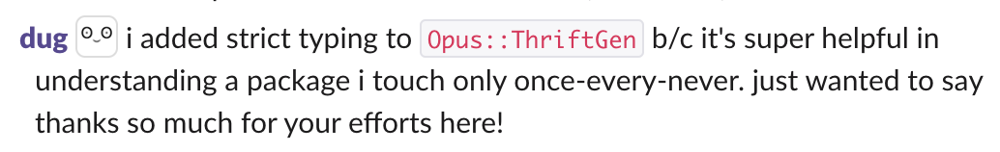
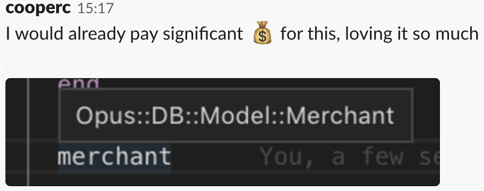
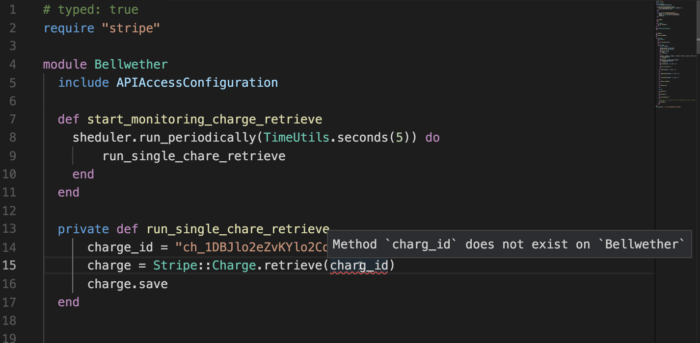
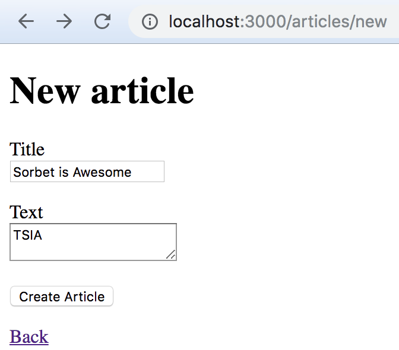

- **About Stripe**

- Design principles

- Adopting Sorbet at Stripe

- Editor Tools for Sorbet

- State of Sorbet

---

## Stripe

- Platform that developers use to accept payments
- 32 countries, millions of business worldwide
- Billions of dollars of processing volume annually
- More than 80% of American adults bought something on Stripe in 2017
- 1,700 people in 10 offices around the world
- Customers report 59% more developer productivity after deploying Stripe
- We're hiring! → [stripe.com/jobs](https://stripe.com/jobs)

---

## Ruby at Stripe

- Ruby is the primary programming language
  - Enforced subset of Ruby (Rubocop!)
  - Not using Rails
- Most product code is in a monorepo (intentionally!)
  - ~10 macroservices with a few microservices
  - New code mostly goes into an existing service

Note:

- Millions of lines of Ruby

---

## Scale of Engineering at Stripe

- Hundreds of engineers
- Thousands of commits per day
- Millions of lines of code

Note:

- Top languages
- Most product engineers use Ruby.
- Next language is 2% - bash

---

- About Stripe

- **Design principles**

- Adopting Sorbet at Stripe

- Editor Tools for Sorbet

- State of Sorbet

---

## Type System Design Principles

1. Explicit
2. Feel useful, not burdensome
3. As simple as possible, but no simpler
4. Compatible with Ruby
5. Scales
6. Adoptable gradually

---

## 1. Explicit

```ruby
sig {params(a: Integer).returns(String)}
def foo(a)
  a.to_s
end
```


Note:
  We're willing to write annotations, and in fact see them as
  beneficial; They make code more readable and predictable. We're here
  to help readers as much as writers.

---

## 2. Not burdensome: local inference

```ruby
sig {returns(String)} # Optional but not inferred
def foo
    a = 5 # Integer
    a = T.let("str", String) # String
end
```

Note:
 some people think that typesystems can be too verbose.
 We agree. This is why we want our to be concise.
 In particular here you don't need to specify type of variable a,
 we can infer that it is integer.

 If you do want to declare a type of variable, we you can do so with T.let.
 In this example, you re-assign a to a string and you explicitly daclare
 that you wanted a to become a string.

---

## 3. Simple but no simpler

Type system has grown by adding features needed to type existing code:
  - Gradual typesystem
  - Union and intersection types
  - Local type inference
  - Control-flow dependent typechecking
  - Generic classes & methods
  - Self types
  - Static & runtime typechecking


Note:
  Overall, we are not strong believers in super-complex type
  systems. They have their place, and we need a fair amount of
  expressive power to model (enough) real Ruby code, but all else
  being equal we want to be simpler. We believe that such a system
  scales better, and -- most importantly -- is easiest for users to
  learn+understand.

---

## 4. Scales

 - With team size
 - With number of teams that have different needs
 - With codebase size
   - Performance of the tool itself
   - Keeping codebase complexity isolated
 - With time (not postponing hard decisions)

Note:   On all axes: in speed, team size, codebase size and time (not
  postponing hard decisions). We're already a large codebase, and will
  only get larger.

---

## 4. Scales: performance

100k lines/second/cpu core


| Tool | Speed (lines/s/core) |
|------|-------:|
| `sorbet`  | 100,000 |
| `javac`   | 10,000  |
| `rubocop` | 1,000   |
<!-- .element: class="fragment"  -->

---

## 5. Compatible with Ruby

  - Standard ruby syntax
  - Works with existing tools: editors, linters & etc

Note:
  In particular, we don't want new syntax. Existing Ruby syntax means
  we can leverage most of our existing tooling (editors, etc). Also,
  the whole point here is to improve an existing Ruby codebase, so we
  should be able to adopt it incrementally.

---

## 6. Adoptable gradually: strictness level

```ruby
#
# Basic checks such as syntax errors are enabled by default
```

<div class="fragment">

```ruby
# typed: true
# Enables type checking
```

<div/>

<div class="fragment">

```ruby
# typed: strict
# Additionally requires all method definitions to be typed
```

<div/>

<div class="fragment">

```ruby
# typed: strong
# The safest level: disallows calling untyped code
```

<div/>

Note:
-  In order to make adoption possible at scale, we cannot require all
-    the teams to adopt it at once, thus we need to support teams adopting it
-    at different pace.

---

## 6. Adoptable gradually: runtime typechecking

---

## Why have runtime typechecking?

- `A.rb`:

```ruby
# typed: true
sig {params(a: Integer).void}
def foo(a)
  ...
  ...
  ...
  ...
end
```

- `B.rb`:

```ruby
# typed: false
foo("1")
```

---
## Why have runtime typechecking?

- Untyped code can call into typed code
- Untyped code can perform stores that are read by typed code
- Typed code cannot protect itself because we will complain that the guard is dead
- Even if all of your code is typed, your gems aren't

---

- About Stripe

- Design principles

- **Adopting Sorbet at Stripe**

- Editor Tools for Sorbet

- State of Sorbet

---

## Adopting Sorbet at Stripe

- **8 months** building from scratch (Oct 2017 – May 2018)
- **7 months** rolling out (Jun 2018 – Dec 2018)
- **4+ months** on editor and OSS tooling (Jan 2019 – ···)

---

## Adopting Sorbet at Stripe

- **8 months** building from scratch (Oct 2017 – May 2018)
- <span style="opacity: 0.3;">**7 months** rolling out (Jun 2018 – Dec 2018)</span>
- <span style="opacity: 0.3;">**4+ months** on editor and OSS tooling (Jan 2019 – ···)</span>

---

## Adopting Sorbet at Stripe

- <span style="opacity: 0.3;">**8 months** building from scratch (Oct 2017 – May 2018)</span>
- **7 months** rolling out (Jun 2018 – Dec 2018)
- <span style="opacity: 0.3;">**4+ months** on editor and OSS tooling (Jan 2019 – ···)</span>

---

### Uninitialized constant errors

```ruby

class Hello

end

def main
  puts Helo.new
end

main
```

<pre><code>


</code></pre>

Note:

Focused on identifying then preventing errors.

---

### Uninitialized constant errors

```ruby

class Hello

end

def main
  puts Helo.new
end

main
```

```console
❯ ruby hello.rb
hello.rb:7:in `main': uninitialized constant Helo (NameError)
Did you mean?  Hello
        from hello.rb:12:in `<main>'
```

Note:

- Maybe we'll hear about it in 5 to 15 minutes when the tests run
- Maybe we'll hear about it later today when we deploy the change
- Maybe we'll hear about it 4 in the morning from a very upset user

---

### Uninitialized constant errors

```ruby

class Hello

end

def main
  puts Helo.new
end

main
```

```console
❯ srb
hello.rb:7: Unable to resolve constant `Helo`
     7 |  puts Helo.new
               ^^^^
```

Note:

- Did we actually succeed in preventing these kinds of errors?

---

### 🎉 100% of Ruby files at Stripe!

```ruby

class Hello

end

def main
  puts Helo.new
end

main
```

```console
❯ srb
hello.rb:7: Unable to resolve constant `Helo`
     7 |  puts Helo.new
               ^^^^
```

---

### Undefined method errors

```ruby

class Hello
  def greeting; 'Hello, world!'; end
end

def main
  puts Hello.new.greet
end

main
```

<pre><code>


</code></pre>

---

### Undefined method errors

```ruby

class Hello
  def greeting; 'Hello, world!'; end
end

def main
  puts Hello.new.greet
end

main
```

```console
❯ ruby hello.rb
hello.rb:7:in `main': undefined method `greet'
Did you mean?  greeting
        from hello.rb:10:in `<main>'
```

Note:

We'd like to be able to use Sorbet to gain even more confidence than tests
alone.

---

### Undefined method errors

```ruby
# typed: true
class Hello
  def greeting; 'Hello, world!'; end
end

def main
  puts Hello.new.greet
end

main
```

```console
❯ ruby hello.rb
hello.rb:7:in `main': undefined method `greet'
Did you mean?  greeting
        from hello.rb:10:in `<main>'
```

---

### Undefined method errors

```ruby
# typed: true
class Hello
  def greeting; 'Hello, world!'; end
end

def main
  puts Hello.new.greet
end

main
```

```console
❯ srb
hello.rb:7: Method greet does not exist on `Hello`
     7 |  puts Hello.new.greet
               ^^^^^^^^^^^^^^^
```

---

### 🎉 80% of Ruby files at Stripe!

```ruby
# typed: true
class Hello
  def greeting; 'Hello, world!'; end
end

def main
  puts Hello.new.greet
end

main
```

```console
❯ srb
hello.rb:7: Method greet does not exist on `Hello`
     7 |  puts Hello.new.greet
               ^^^^^^^^^^^^^^^
```

Note:

Why only 80%?

Getting files into `typed: true` means fixing a lot of errors!
We built tools to automate the process, but it's still work.

---

### More than just errors

- What types does this method take?
- Could this thing be nil?

---

### &nbsp;

```ruby

def do_thing(x)
  # ...
end

do_thing('some string')  # is this ok?
do_thing(nil)            # is this ok?
```

---

### &nbsp;

```ruby
sig {params(x: String).void}
def do_thing(x)
  # ...
end

do_thing('some string')  # is this ok?
do_thing(nil)            # is this ok?
```

---

### &nbsp;

```ruby
sig {params(x: String).void}
def do_thing(x)
  # ...
end

do_thing('some string')  # 😎 this is ok!
do_thing(nil)            # ❌ this is not ok!
```

---

### 🎉 62% of methods at Stripe have a signature!

```ruby
sig {params(x: String).void}
def do_thing(x)
  # ...
end

do_thing('some string')  # 😎 this is ok!
do_thing(nil)            # ❌ this is not ok!
```

---

### ⏪ Recap: What we achieved

- **100%** of files: catch uninitialized constants!
- **80%** of files: catch NoMethodError's!
- **62%** of methods have signatures!

Note:

- Proud of our progress, versus our peers, and how early stage we are
- We like to think our progress is because of how well designed Sorbet is

---

## What our users say

---

### A tool for understanding



---

### An interactive experience


---

### Sorbet editor extension



Note:

One weekend, Dmitry built a prototype of an editor extension integrating Sorbet.

---

## And it's fast 💨

&nbsp;

&nbsp;

Note:

At first, we would have been ok with taking 20 minutes.
Now, we're getting asked for *sub-second* response times.

---

## And it's fast 💨

Millions of lines of code...

... completes in seconds.

Note:

At first, we would have been ok with taking 20 minutes.
Now, we're getting asked for *sub-second* response times.

---

## What we learned

- Sorbet is powerful enough to fit many needs
- People want Sorbet in their editor
- Automated tooling can make adoption faster

---

## Adopting Sorbet at Stripe

- <span style="opacity: 0.3;">**8 months** building from scratch (Oct 2017 – May 2018)</span>
- **7 months** rolling out (Jun 2018 – Dec 2018)
- <span style="opacity: 0.3;">**4+ months** on editor and OSS tooling (Jan 2019 – ···)</span>

---

## Adopting Sorbet at Stripe

- <span style="opacity: 0.3;">**8 months** building from scratch (Oct 2017 – May 2018)</span>
- <span style="opacity: 0.3;">**7 months** rolling out (Jun 2018 – Dec 2018)</span>
- **4+ months** on editor and OSS tooling (Jan 2019 – ···)

---

- About Stripe

- Design principles

- Adopting Sorbet at Stripe

- **Editor Tools for Sorbet**

- State of Sorbet

---

### VS Code



Note:
- Don't say LSP

---

### Errors & Hover


---

### Go To Definition


---

### Autocomplete + Docs


---

## Try it yourself!

https://sorbet.run

(IDE features only work on desktop)

---

- About Stripe

- Design principles

- Adopting Sorbet at Stripe

- Editor Tools for Sorbet

- **State of Sorbet**


---

## 🎉 Ruby 3 & Types!

- Ruby 3 stdlib will ship with type definitions
- We're collaborating closely with the Ruby core team
- See talks by **@matz**, **@soutaro**, and **@mame**

---

## 🎉 Open source!

- After extensive private beta with 40+ companies 
- Check it on https://sorbet.org/

Note:
- Coinbase
- Shopify
- SourceGraph

---

## 🎉 Open source tooling

```ruby
# Gemfile
gem 'sorbet', :group => :development
gem 'sorbet-runtime'
```

```bash
❯ srb init
...
```

```bash
❯ srb
No errors! Great job
```

Note:
- We are deploying using standard Ruby tooling

---

## An Initialized Project

```bash
sorbet/
│ # Default options to passed to sorbet on every run
├── config
└── rbi/
    │ # Community-written type definition files for your gems
    ├── sorbet-typed/
    │ # Autogenerated type definitions for your gems
    ├── gems/
    │ # Things defined when run, but hidden statically
    ├── hidden-definitions/
    │ # Constants which were still missing
    └── todo.rbi
```

---

## `sorbet-typed` (by Coinbase)

https://github.com/sorbet/sorbet-typed/

> A central repository for sharing type definitions for Ruby gems

Note:
- A way to share type definitions for gems

---

## DSL Extension (by Shopify)

```ruby
attribute my_id, :integer
```

becomes

```ruby
sig {returns(T.nilable(Integer))}
def my_id; end

sig {returns(T::Boolean)}
def my_id?; end

sig {params(new_value: T.nilable(Integer)).void}
def my_id=(new_value); end
```

Note:
- You can teach sorbet about your DSL

---

## Implementation

```ruby
attribute my_id, :integer
```

```bash
❯ srb tc --dsl-plugins plugins.yaml
```

```yaml
# plugins.yaml
attribute: attribute.rb
```

```ruby
# attribute.rb
prop, type = STDIN.gsub("attribute ", "").delete(":").split(",")

puts "sig {returns(T.nilable(#{type.upcase}))}"
puts "def #{prop}; end"
...
```

```ruby
sig {returns(T.nilable(Integer))}
def my_id; end
...
```

---

## Typechecking Rails

```
❯ rails new blog
```

<div style="height:400px">

</div>

---

## It typechecks!

```bash
❯ git grep -h typed: | sort | uniq -c
    2 # typed: false
  120 # typed: true
```

Note:
- 98.3% of files are true

---

## RubyGems.org

```bash
❯ git grep -h typed: | sort | uniq -c
  189 # typed: false
  265 # typed: true
```

- Real codebase
- 58% `typed: true` out of the box

---

## Gitlab

```bash
❯ git grep -h typed: | sort | uniq -c
    47 # typed: ignore
  6516 # typed: false
  1579 # typed: true
```

- Big codebase
- 99% `typed: false` or better
- 19% `typed: true` out of the box

---

## Typechecking Rails

- Only needed 7 hand-written type signatures
- 1 new feature
- Most other signatures are autogenerated by reflection

---

## Closing

- Editors under active development
- Open sourced!
- Works with Rails
- Docs are live at [sorbet.org](https://sorbet.org)

---

# 🙇‍♂️ Thank you

Get ready, Sorbet is coming!

[sorbet.org](https://sorbet.org)
